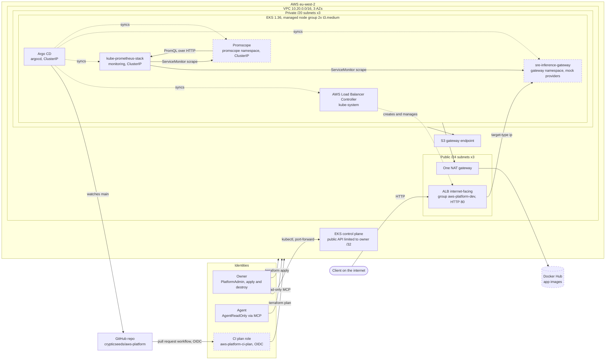

# Architecture

What the P1 foundation looks like once `envs/dev` is applied and Argo CD has synced. Every box below is backed by a file in this repo (table after the diagram). Boxes drawn with a dashed border are **planned**: designed or partly written, not yet buildable or not yet wired in.

Nothing has been applied yet at the time of writing, so this document describes the design as committed, not a measured deployment. Costs are in [cost.md](cost.md).

## Diagram

### What backs each box

| Box | Backing file | State |
|---|---|---|
| VPC, 3 AZs, private /20s, public /24s | `modules/network/main.tf`, `envs/dev/main.tf` (`az_count = 3`, `10.20.0.0/16` in `envs/dev/variables.tf`) | built in code |
| One NAT gateway | `modules/network/main.tf` (`single_nat_gateway = true`), [ADR 0004](decisions/0004-single-nat-gateway.md) | built in code |
| S3 gateway endpoint | `modules/network/main.tf` (`aws_vpc_endpoint.s3`) | built in code |
| EKS 1.36, control plane | `modules/cluster/main.tf`, `envs/dev/variables.tf` (`kubernetes_version = "1.36"`) | built in code |
| Managed node group, 2x t3.medium | `modules/cluster/main.tf` (`eks_managed_node_groups`), `modules/cluster/variables.tf` (min 2, desired 2, max 3) | built in code |
| ALB, group `aws-platform-dev` | `charts/sre-inference-gateway/templates/ingress.yaml`, `charts/sre-inference-gateway/values-dev.yaml` (`groupName`). The ALB is created at runtime by the controller from that Ingress. | chart exists, ALB created only when the gateway is synced (see gateway row) |
| AWS Load Balancer Controller | `argocd/apps/aws-load-balancer-controller.yaml`, `envs/dev/aws-load-balancer-controller.tf` (IAM role and Pod Identity association) | built in code |
| Argo CD | `argocd/values.yaml`, `argocd/root.yaml`, `argocd/bootstrap-project.yaml`, [ADR 0011](decisions/0011-argocd-install-by-helm.md), `docs/runbooks/deploy.md` step 4 | built in code, installed by the owner with Helm |
| kube-prometheus-stack | `argocd/apps/kube-prometheus-stack.yaml` | built in code |
| Gateway with mock providers | `charts/sre-inference-gateway/` (`values-dev.yaml` enables only `type: "mock"` providers) | built in code (`argocd/workloads/sre-inference-gateway.yaml`, image pinned by SHA); runs once the owner applies it by hand |
| Promscope | `charts/promscope/` (`templates/service.yaml` is ClusterIP) | built in code (`argocd/workloads/promscope.yaml`, image pinned by SHA); runs once the owner applies it by hand |
| Docker Hub images | [ADR 0006](decisions/0006-docker-hub-not-ecr.md), `crypticseeds/sre-inference-gateway` and `crypticseeds/promscope` on Docker Hub (built and pushed by workflows in the app repos) | published 2026-10-05 and 2026-10-06 (promscope PR #1, gateway PR #30); namespace decided (DEV-125) |
| CI OIDC plan role | `account/main.tf` (`aws_iam_role.ci_plan`, `aws_iam_openid_connect_provider.github`), `.github/workflows/terraform-plan.yml`, `docs/runbooks/account.md` | in code and in use: role (PR #9, DEV-133) and plan-only workflow (PR #17, DEV-135, merged 2026-10-06; run 37392939869 passed all three plan jobs). `.github/workflows/checks.yml` runs static checks with no AWS access |
| GitHub repo | `argocd/root.yaml` (`repoURL`) | exists |
| Owner (PlatformAdmin) | `modules/cluster/main.tf` (access entry for the `PlatformAdmin` SSO role), [ADR 0002](decisions/0002-identity-center-and-read-only-agent.md) | permission sets live in Identity Center, outside this repo |
| Agent (AgentReadOnly) | `policies/agent-readonly-inline.json`, [ADR 0002](decisions/0002-identity-center-and-read-only-agent.md) | AWS side in place. Kubernetes RBAC for the agent is in code (`platform/agent-rbac/`, `argocd/apps/agent-rbac.yaml`, access entry in `modules/cluster/main.tf`; PR #18, DEV-136, merged 2026-10-06), not yet verified on a running cluster |

Dotted arrows are runtime actions (Argo CD syncing, the controller creating the ALB). The `syncs` arrows to the gateway and Promscope are in code (`argocd/workloads/`); they are not part of the root app, and nothing runs until the owner applies each one by hand (DEV-167).

## Trust boundaries

Three identities, three different reach. All short-lived credentials, no access keys ([ADR 0002](decisions/0002-identity-center-and-read-only-agent.md), [ADR 0007](decisions/0007-plan-only-ci.md)).

| Identity | Can | Cannot | How it authenticates |
|---|---|---|---|
| Owner, `PlatformAdmin` | Everything: `terraform apply` and `destroy`, `kubectl` as cluster admin (EKS access entry) | Nothing is blocked. The management account has no SCPs ([ADR 0001](decisions/0001-single-aws-account.md)), so IAM is the only guard | Identity Center SSO with MFA, 2-hour sessions |
| Agent, `AgentReadOnly` | Read AWS and EKS through the managed AWS and EKS MCP servers | Write anything, read Secrets Manager values, decrypt, read state objects (`*tfstate*`) | Own SSO user that can hold only this permission set. CloudTrail marks its calls `invokedBy: aws-mcp.amazonaws.com` |
| CI, `aws-platform-ci-plan` | `terraform plan`: `ReadOnlyAccess`, read state, create and delete only `*.tflock` objects | Apply, destroy, or be assumed by anything but this repo's pull request workflows | GitHub OIDC, `aud = sts.amazonaws.com`, `sub = repo:<repo>:pull_request`, 1-hour sessions |

Two things to keep in mind. CI can read state and the agent cannot; that is intended, a plan needs state. And the agent's Kubernetes access is read-only RBAC (DEV-136, merged 2026-10-06) with no Secret reads; it has not been exercised on a running cluster yet.

## Request flow

The gateway is the only application path from the internet. Once the gateway Argo CD Application is synced it works like this:

1. A client sends HTTP to the ALB's DNS name (port 80, internet-facing, no TLS in P1). The ALB's security group allows only the owner's IP, the same CIDRs as the Kubernetes API allow-list (DEV-164).
2. The ALB listens in the three public subnets and routes straight to pod IPs (`target-type: ip`, possible because the VPC CNI gives pods VPC addresses). Health check path is `/v1/health`. Idle timeout is 120 seconds so streaming (SSE) responses are not cut between chunks.
3. The gateway pod picks a provider by weight. In dev, both providers are mocks (`mock_openai`, `mock_vllm`, weight 0.5 each) running inside the gateway process, so there is no outbound LLM call and no API key anywhere in the deployment.
4. Prometheus scrapes `/metrics` on the gateway's API port (`http`, 8000) through a ServiceMonitor.

All Ingresses share the group name `aws-platform-dev`, so any later app joins the same ALB instead of paying for another.

## GitOps flow

1. The owner applies `envs/dev`, then installs Argo CD once with Helm and applies `argocd/bootstrap-project.yaml` and `argocd/root.yaml` ([deploy runbook](runbooks/deploy.md), [ADR 0011](decisions/0011-argocd-install-by-helm.md)).
2. `root` is an app-of-apps watching `argocd/apps/` on `main` of this repo, with automated sync, prune and selfHeal. It holds only the platform. A file added there is created, a file removed is pruned, a manual change in the cluster is reverted.
3. Sync waves order the platform rollout: the `aws-platform` AppProject (-4), cert-manager (-3, issues the Load Balancer Controller's webhook certificate), the Load Balancer Controller and agent RBAC (-2), kube-prometheus-stack (-1), then the Grafana dashboards (0).
4. The workloads (`argocd/workloads/sre-inference-gateway.yaml`, `argocd/workloads/promscope.yaml`) are not read by `root`. The owner applies each with `kubectl apply -f` when wanted, one at a time; from then on it syncs from `main` like the rest ([ADR 0011](decisions/0011-argocd-install-by-helm.md), amendment, DEV-167).
5. Terraform stays AWS-only. It creates the Load Balancer Controller's IAM role and Pod Identity association, and nothing inside the cluster ([ADR 0009](decisions/0009-eks-security-choices.md)).
6. Everything is lost on `terraform destroy` and rebuilt from git. Apps and the controller must be removed before destroy because they create ALBs and security groups outside Terraform (ADR 0011; the teardown order is DEV-145).

## What is deliberately not exposed

- **Argo CD, Grafana, Prometheus, Alertmanager and Promscope** are `ClusterIP` only, reached with `kubectl port-forward`. Promscope has no authentication, so it must never be published. The Load Balancer Controller's Service mutator webhook is off, so a stray `type: LoadBalancer` Service does not silently create a paid NLB.
- **The Kubernetes API** has a public endpoint, but only for the owner's single IPv4 `/32` addresses, enforced by variable validation. `0.0.0.0/0` and wide ranges are rejected ([ADR 0009](decisions/0009-eks-security-choices.md)). Nodes use the private endpoint.
- **Nodes** have no public IPs. Outbound goes through the one NAT gateway; the S3 gateway endpoint keeps S3 traffic off it.
- **No secrets in the repo.** Kubernetes Secrets are created by the owner from Doppler and referenced by name.

What is exposed on purpose: the ALB, on plain HTTP port 80 with no authentication in front of the gateway. That is acceptable only because the dev gateway serves mock responses. TLS and auth are not designed yet and should be decided before any real provider key is added.

Known gaps, all accepted for a disposable dev cluster: single NAT (one AZ outage cuts egress, [ADR 0004](decisions/0004-single-nat-gateway.md)), AWS-owned encryption key instead of a CMK ([ADR 0009](decisions/0009-eks-security-choices.md)), and Prometheus and Grafana on `emptyDir` so metrics are lost on a pod restart.

## Related decisions

[0001 single account](decisions/0001-single-aws-account.md), [0002 identities](decisions/0002-identity-center-and-read-only-agent.md), [0003 community modules](decisions/0003-community-vpc-and-eks-modules.md), [0004 single NAT](decisions/0004-single-nat-gateway.md), [0005 S3 state locking](decisions/0005-s3-native-state-locking.md), [0006 Docker Hub](decisions/0006-docker-hub-not-ecr.md), [0007 plan-only CI](decisions/0007-plan-only-ci.md), [0008 tagging and layering](decisions/0008-tagging-and-layering.md), [0009 EKS security](decisions/0009-eks-security-choices.md), [0010 state layout](decisions/0010-multi-project-state-layout.md), [0011 Argo CD install](decisions/0011-argocd-install-by-helm.md).
