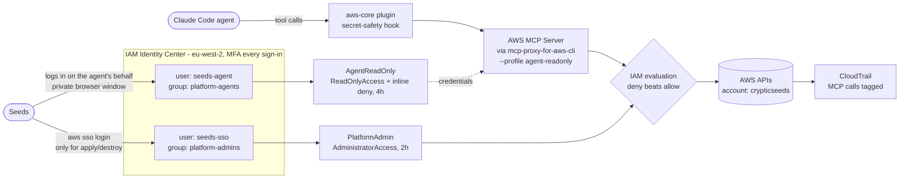

# Secure AWS access for a human and an AI agent

Journal entry 01 for the aws-platform project. Written 2026-10-02.

This records how Seeds (the owner) set up AWS access for themselves and for an AI coding agent (Claude Code) before writing any Terraform. It is meant to be read three ways: as a blog draft, as interview evidence, and as a runbook to repeat the setup from scratch.

## TL;DR

- Nobody uses long-lived AWS access keys. Both the owner and the agent get short-lived credentials from IAM Identity Center (SSO), with MFA on every sign-in.
- The owner has one login (`seeds-sso`) with full admin (`PlatformAdmin`, 2-hour sessions), used only for `terraform apply` and `destroy`.
- The agent has its own separate login (`seeds-agent`) that can only hold `AgentReadOnly`: AWS's `ReadOnlyAccess` plus a short deny list covering the reads that actually expose secrets.
- The agent reaches AWS only through the AWS-managed MCP Server, pinned to the agent profile. It cannot use the AWS CLI from its shell because the shell sandbox blocks the SSO token cache.
- IAM is the real control. Everything else (MCP server choice, a plugin hook, the sandbox) is a second layer.
- Doppler stays the store for application secrets (Docker Hub token, Grafana password, database credentials), not for AWS access.

### Final architecture



## Why agentic workflows need this level of permission design

An AI agent is not a script. A script calls the same APIs every time; you can read its code and grant exactly what it calls. An agent decides at runtime which tool to call and with what arguments. AWS's security guidance for agents (see References) starts from that fact and sets out three principles.

1. **Assume every granted permission will be used.** Size permissions by the damage you can accept, not by what the agent is supposed to do. Concrete failure modes:
   - Hallucination: the agent misreads the task and acts on the wrong resource.
   - Prompt injection: text the agent reads (a web page, a log line, a README, an error message) contains instructions, and the agent follows them.
   - Logic errors: the agent reasons its way to a wrong conclusion ("this bucket looks unused, delete it").
   - Tool poisoning: a compromised MCP server or dependency uses the agent's credentials for its own purposes.

   Agents act at machine speed, so a mistake can become thousands of API calls before a human notices.

2. **Give agents their own roles, narrower than the human's, with organisational guardrails.** Do not hand the agent your admin profile. In a company, permission boundaries and SCPs enforce this even if a developer configures the wrong role.

3. **Tell AI-driven actions apart from human ones.** AWS-managed MCP servers add two IAM condition keys to every downstream call: `aws:ViaAWSMCPService` (true when the call came through a managed MCP server) and `aws:CalledViaAWSMCP` (which server). Policies can deny, for example, deletes that come through MCP while still allowing the same human to delete directly. CloudTrail records the MCP server as `invokedBy`, so agent activity can be audited separately (see "Auditing what the agent does" below).

**The agent has two paths to AWS.** Claude Code can call the MCP server, but it also has a shell, and in a shell it could run `aws ...` or a boto3 script directly. Those direct calls do not carry the MCP condition keys, so principle 3 does not cover them. Only the role's own permissions (principles 1 and 2) protect that path. That is why the agent's role is read-only at the IAM level, and why this setup also closes the shell path (see "MCP-only").

## Concepts in plain English

| Term | Meaning |
|---|---|
| Root user | The account owner, signed in with the account's email address. Can do anything, including closing the account. Locked away with MFA and used only in emergencies. |
| IAM user | A permanent named login inside one account. Can have a password and long-lived access keys. |
| IAM role | A set of permissions you "wear" temporarily. No password; you get short-lived credentials while wearing it. |
| Policy | A JSON document listing allowed or denied actions. An explicit **Deny always beats an Allow**, wherever it appears. |
| AWS Organization | A group of AWS accounts under one management account, with consolidated billing. |
| SCP (service control policy) | An Organization-level rule that caps what any principal in a member account can do (for example "only London region"). It does not apply to the management account. |
| IAM Identity Center | AWS's single sign-on service. Users sign in through a web portal with MFA and receive temporary credentials for the roles they are assigned. |
| Permission set | Identity Center's template for a role. Assigning a permission set to a user or group on an account creates a matching IAM role (named `AWSReservedSSO_<name>_<id>`) in that account. |
| SSO session token | What `aws sso login` stores locally after browser approval. It can fetch temporary credentials for **any** permission set the signed-in user holds. That one property drives the "separate agent user" decision below. |

## Step by step: what was done and why

Starting state: one AWS account (name `crypticseeds`) with the root user secured and unused, and an IAM user (`devopsfoundry`, `AdministratorAccess`, console only, no access keys) used for day-to-day console work. Billing alerts already existed. AWS CLI v2 (2.27) and `uv` were already installed locally.

### 1. Check the root user

Sign in as root once and confirm: MFA on (passkey or hardware key preferred), no root access keys, alternate contacts filled in. Then stop using root.

Why: root cannot be restricted by IAM. It should only exist as a break-glass identity.

### 2. Discover the Organization

The Organizations console showed that an Organization already existed (probably created by an earlier setup wizard), with the SCP policy type disabled and no RCPs attached. Nothing needed changing.

Why it matters: Identity Center needs an Organization for multi-account access. Because this account is the management account, SCPs would not apply to it even if enabled (see Decisions).

### 3. Move Identity Center to London

Identity Center was already enabled, but in us-east-1. Region choice matters because it determines where identity data lives and where you administer Identity Center from. The only way to change it is to delete the instance and recreate it. It does not limit where you can build: a us-east-1 instance can grant access to eu-west-2 resources.

Seeds chose to move it so that everything lives in eu-west-2. It was safe to delete because it was still empty.

- First, check that Users, Permission sets and Applications are empty or unused. Watch for Amazon Q Developer or Kiro subscriptions, which depend on Identity Center.
- Delete, in the old region: IAM Identity Center > Settings > Management tab > Delete IAM Identity Center configuration.
- Recreate: switch the console region to Europe (London) eu-west-2 **before** clicking Enable, then choose the AWS Organizations option.

### 4. Require MFA on every sign-in

IAM Identity Center > Settings > Authentication > Multi-factor authentication > Configure:

- Prompt: every time they sign in.
- Methods: security keys and built-in authenticators (passkeys, Touch ID, hardware keys). An authenticator app is acceptable.
- Users with no MFA device: must register one at sign-in.

### 5. Create the owner's login

- Group `platform-admins`. Permissions attach to groups, not to people.
- User `seeds-sso`, added to `platform-admins`. The username was chosen to be distinct from the account name and from other logins, so CloudTrail lines read clearly ("seeds-sso did X in account crypticseeds").
- The invite email goes to an inbox Seeds controls long-term and that has MFA. Whoever controls that inbox can reset the login.
- Accept the invite, set a password, register MFA. The access portal shows "no accounts" until step 6.

Root and the IAM user are not added to Identity Center. Identity Center keeps its own user directory.

### 6. Give the owner admin: `PlatformAdmin`

- Permission sets > Create > Predefined > `AdministratorAccess`. Name `PlatformAdmin`, session duration **2 hours**, so a forgotten session expires on its own.
- AWS accounts > tick `crypticseeds` > Assign users or groups > group `platform-admins` > `PlatformAdmin`.
- Test: refresh the portal, open `PlatformAdmin`. The console shows `PlatformAdmin/seeds-sso`.

### 7. Give the agent its own user and read-only access: `AgentReadOnly`

**Why a separate user and not a second permission set on `seeds-sso`?** An SSO session token can fetch credentials for any permission set its user holds. If `seeds-sso` held both admin and read-only, the token created for the agent could also fetch admin. A separate user `seeds-agent` that only holds `AgentReadOnly` means the agent's login cannot become admin, whatever the agent does with it.

Steps:

1. Group `platform-agents`.
2. User `seeds-agent` (a second email address, a plus address is fine), added to `platform-agents`. Accept the invite **in a private browser window** so it does not collide with the `seeds-sso` session, and register its own MFA.
3. Permission set: the Custom flow's managed-policy search did not surface `ReadOnlyAccess` easily, so it was created as **Predefined > `ReadOnlyAccess`**. Name `AgentReadOnly`, session **4 hours**, tag `Usage` = `Agent` (AWS recommends tagging agent roles for inventory and audit).
4. **Before assigning it**, open the permission set > Permissions tab > Inline policy and paste the deny policy below. Doing this first means the agent never holds access without the deny list.
5. Check that the Permissions tab shows both `ReadOnlyAccess` (AWS managed) and the inline policy.
6. Assign group `platform-agents` > `AgentReadOnly` on `crypticseeds`.

The inline policy, exactly as saved in `policies/agent-readonly-inline.json`:

```json
{
  "Version": "2012-10-17",
  "Statement": [
    {
      "Sid": "DenySecretValues",
      "Effect": "Deny",
      "Action": [
        "secretsmanager:GetSecretValue",
        "kms:Decrypt",
        "rds:DownloadDBLogFilePortion",
        "rds:DownloadCompleteDBLogFile"
      ],
      "Resource": "*"
    },
    {
      "Sid": "DenyTerraformStateContents",
      "Effect": "Deny",
      "Action": [
        "s3:GetObject",
        "s3:GetObjectVersion"
      ],
      "Resource": "arn:aws:s3:::*tfstate*/*"
    }
  ]
}
```

What each deny does:

| Denied | Why it is a real secret path |
|---|---|
| `secretsmanager:GetSecretValue` | Returns the secret itself. |
| `kms:Decrypt` | Decrypts anything encrypted with KMS. This also covers SSM SecureString parameters, which need KMS to decrypt, so SSM itself did not need a separate deny. |
| `rds:DownloadDBLogFilePortion`, `rds:DownloadCompleteDBLogFile` | Database logs can capture credentials, for example from an `ALTER USER ... PASSWORD` statement. |
| `s3:GetObject`, `s3:GetObjectVersion` on `*tfstate*` buckets only | Terraform state stores generated passwords, keys and certificate material in plain text. Every other S3 object stays readable. |

**What was deliberately NOT denied, and why.** The first draft also denied all S3 object reads, SSM parameter reads, DynamoDB item reads, Lambda function reads and `ec2:GetPasswordData`. Seeds pushed back: most of those are ordinary reads, and blocking them would get in the way of legitimate debugging without protecting anything. Each was re-examined:

- **S3 reads in general:** normal. Only the state file matters, so the deny targets it by name.
- **SSM parameters:** plain parameters are ordinary configuration. AWS publishes public ones the agent needs, such as EKS-optimised AMI IDs. SecureString values are already covered by the `kms:Decrypt` deny.
- **DynamoDB:** the Terraform lock table holds lock records only. Terraform 1.10+ can lock in S3 natively, so the table may not exist at all.
- **Lambda environment variables:** a real secret path in general, but this project does not use Lambda, so the deny protected nothing here.
- **`ec2:GetPasswordData`:** returns a Windows password already encrypted with your own key pair, so it is useless without the private key. There is no Windows in this project.

The rule this creates: **the Terraform state bucket name must contain `tfstate`.**

**Out of scope for IAM:** Kubernetes Secrets (image pull secret, Grafana password) are protected by cluster RBAC, not by AWS IAM. The agent's Kubernetes access is a separate decision for when the cluster exists.

### 8. Connect both logins to the terminal

Each login gets its own `sso-session` in `~/.aws/config`. That file holds names and URLs, not secrets. Separate sessions mean separate tokens: logging in as the agent never yields an admin-capable token.

Owner (admin):

```
aws configure sso
# SSO session name: seeds-admin
# SSO start URL: <your access portal URL>
# SSO region: eu-west-2
# scopes: default
# approve in the browser as seeds-sso
# account/role: crypticseeds / PlatformAdmin
# default region: eu-west-2, output: json
# profile name: platform-admin
```

Agent (read-only). Use `--no-browser` so the approval link is printed rather than opened in a browser that may already be signed in as `seeds-sso`:

```
aws configure sso --no-browser
# SSO session name: seeds-agent
# same start URL, SSO region eu-west-2, default scopes
# open the printed link in a PRIVATE window, sign in as seeds-agent
# the only role offered must be AgentReadOnly (if PlatformAdmin appears, stop)
# default region: eu-west-2, output: json
# profile name: agent-readonly
```

Check both:

```
aws sts get-caller-identity --profile platform-admin   # expect PlatformAdmin/seeds-sso
aws sts get-caller-identity --profile agent-readonly   # expect AgentReadOnly/seeds-agent
```

Both returned the expected identities.

### 9. MCP: give the agent AWS access through the managed AWS MCP Server

**What the Agent Toolkit for AWS is.** AWS's successor to the earlier `awslabs/mcp` servers. It has four parts:

- **AWS MCP Server:** managed by AWS, with an eu-west-2 endpoint. It provides docs search, skills, and authenticated API access through `run_script`, which runs Python with `call_boto3` in an AWS-hosted sandbox.
- **Skills:** task guides the agent loads on demand.
- **Plugins:** one-step installs for Claude Code.
- **Rules files:** project-level guardrails.

The server adds no permission model of its own. It signs requests with whatever IAM credentials the local proxy gives it.

**Review the plugin before trusting it.** The `aws-core` plugin's files were read before installing:

- Its bundled MCP config pointed at the us-east-1 endpoint, named no profile (so it would use whatever default credentials existed) and used `--skip-auth`. That did not fit this setup.
- Its Claude Code hook (`secret-safety.py`) runs before Bash and AWS MCP tool calls and blocks Secrets Manager `GetSecretValue` attempts (CLI, SDK or MCP shapes). It is benign and adds a layer on top of the IAM deny, so it was kept.

**Setup:**

1. `/plugin install aws-core@claude-plugins-official`, then `/reload-plugins`. This gives skills and the hook.
2. `/mcp` > disable `plugin:aws-core:aws-mcp`. AWS advises against running duplicate AWS MCP servers because overlapping tools confuse the agent.
3. Create the project-level `.mcp.json` in the repo root. It holds no secrets and is meant to be committed as evidence:

```json
{
  "mcpServers": {
    "aws": {
      "command": "uvx",
      "args": [
        "mcp-proxy-for-aws-cli==1.7.0",
        "https://aws-mcp.eu-west-2.api.aws/mcp",
        "--profile",
        "agent-readonly",
        "--region",
        "eu-west-2"
      ]
    }
  }
}
```

| Setting | Why |
|---|---|
| `mcp-proxy-for-aws-cli==1.7.0` | The CLI distribution pins its whole dependency tree, and pinning the version (the same one AWS's plugin uses) stops a future compromised release arriving silently. |
| eu-west-2 endpoint | Same region as everything else. |
| `--profile agent-readonly` | The server can only ever sign with the agent's credentials. |
| No `--read-only` | See Gotchas: the flag hides `run_script`, which is the only way to read the account. |

4. Pre-warm the package so the first start does not exceed Claude Code's 30-second MCP timeout: `uvx mcp-proxy-for-aws-cli==1.7.0 --help`.
5. Log the agent in: `aws sso login --profile agent-readonly --no-browser`, then open the link in a private window as `seeds-agent`.
6. Restart Claude Code in the repo, approve the project's `aws` MCP server, and confirm in `/mcp` that it is connected.

## Decisions and trade-offs

| Decision | Alternatives considered | Why |
|---|---|---|
| Identity Center SSO, short-lived credentials | IAM user access keys stored in Doppler and injected with `doppler run` | Keys in a vault are still long-lived keys. SSO gives expiring credentials, MFA on every sign-in and nothing at rest. Doppler is kept for application secrets only. |
| Single account (`crypticseeds`) | Organization with a dedicated member account `aws-platform-dev` | Limited time and many experiments; one account means nothing extra to track. The cost: SCPs never apply to the management account, so IAM is the only guardrail. A company would use per-environment accounts created through account vending (Control Tower Account Factory or Terraform), with SCP guardrails. On the job, accounts are long-lived and what gets created and destroyed is the infrastructure inside them, which is what this project does with `terraform destroy`. |
| Identity Center in eu-west-2 | Keep the existing us-east-1 instance | Functionally either works. Moving was cheapest while the instance was empty, and it keeps everything in one region. |
| Separate agent user `seeds-agent` | A second permission set on the owner's user | An SSO token can mint any permission set its user holds. Only a separate user guarantees the agent's token cannot become admin. |
| Targeted denies only | Broad denies on all data-plane reads | Broad denies blocked harmless reads and added friction without adding protection. Denies now cover the real secret paths only. |
| Agent reaches AWS through MCP only | Agent also uses the AWS CLI from its shell | The Claude Code shell sandbox blocks reads of `~/.aws/sso`, and that folder holds both logins' tokens. Opening it to the agent would expose the admin token too. MCP calls also carry the `aws:ViaAWSMCPService` key and show up separately in CloudTrail. |
| No `--read-only` on the proxy | Keep `--read-only` | The flag hides `run_script` and `get_presigned_url`, leaving no way to read account state. IAM (`AgentReadOnly`) is the authoritative control and still refuses every write. |
| Pin `mcp-proxy-for-aws-cli==1.7.0` | `@latest` | Supply-chain hygiene. Upgrades become deliberate. |
| Session lengths 2h admin, 4h agent | Defaults | A forgotten admin session expires quickly. The agent gets a working half-day before re-login. |

## Gotchas and lessons learned

- **`--read-only` hid every account-reading tool.** The proxy hides any tool not annotated `readOnlyHint=true`. A script *can* write, so `run_script` was hidden, leaving only docs, skills and region tools. The lesson: client-side tool filtering is coarse; least-privilege IAM is the control that matters. This should have been caught from the docs before it was recommended.
- **Over-blocking.** The first deny list blocked harmless reads. It was trimmed after the owner challenged each entry. Ask of every deny: "does this read actually return a secret?"
- **Plugin MCP timeout.** The plugin's server timed out on first start because `uvx` was downloading the package. Pre-warm with `uvx <package>==<version> --help`.
- **Claude Code's auto-mode classifier blocked the agent twice.** Once when writing `.mcp.json` with `--skip-auth` (flagged as a safety bypass; the flag was dropped and the owner created the file), and once when trying a `CreateBucket` write test through MCP (flagged as modifying shared resources). In both cases the agent stopped and handed the action to the owner rather than working around it.
- **Markdown links don't render in a terminal.** Guides and links were moved into plain text and raw URLs.
- **Same macOS user.** The agent and the owner run as the same OS user, so a determined process could reach the admin SSO token while it is cached. Mitigation: log in as admin only to apply or destroy, then `aws sso logout`. The sandbox and deny rules guard against accidents, not against a determined attacker.
- **The browser decides which identity approves an SSO login.** If the default browser is signed in as `seeds-sso`, an agent login approved there becomes an admin-capable token. Always use `--no-browser` and a private window for `seeds-agent`.

## Auditing what the agent does

Every call the agent makes through the AWS MCP Server leaves two kinds of CloudTrail record:

| Record | Event source | What it shows |
|---|---|---|
| The tool call itself, e.g. `CallReadWriteTool` | `aws-mcp.amazonaws.com` | That the agent invoked an MCP tool, from which machine (`sourceIPAddress` is the local IP), with which client (`userAgent` names `mcp-proxy-for-aws` and Claude Code) |
| Each AWS API call the tool made, e.g. `DescribeVpcs` | The real service, e.g. `ec2.amazonaws.com` | The actual action, with `userIdentity.invokedBy`, `sourceIPAddress` and `userAgent` all set to `aws-mcp.amazonaws.com`, and the identity `AgentReadOnly/seeds-agent` |

An example downstream record, trimmed:

```json
{
  "eventSource": "ec2.amazonaws.com",
  "eventName": "DescribeVpcs",
  "userIdentity": {
    "arn": "arn:aws:sts::<account>:assumed-role/AWSReservedSSO_AgentReadOnly_<id>/seeds-agent",
    "invokedBy": "aws-mcp.amazonaws.com"
  },
  "sourceIPAddress": "aws-mcp.amazonaws.com",
  "eventCategory": "Management",
  "managementEvent": true
}
```

**Management or data event?** The category follows the API being called, not the route it came by:

- `ListBuckets`, `DescribeVpcs` and `GetCallerIdentity` are management events whether a human or the agent calls them.
- S3 `GetObject` is always a data event.

This was checked in this account on 2026-10-03. CloudTrail event history, which only ever contains management events, listed the agent's MCP-invoked `DescribeVpcs`, `ListBuckets` and `GetCallerIdentity` calls, and the `CallReadWriteTool` call as well. So a standard trail logging management events (set up in journal 02) records essentially all of the agent's activity. The exceptions are data-plane reads such as reading S3 objects. AWS's security blog post on MCP access patterns describes MCP-originated calls as data events, and its example happens to be an S3 `GetObject`, which is a data event either way. Enable data events only if you need those object-level reads in the audit too.

To pull out only the agent's activity, filter on `userIdentity.invokedBy = aws-mcp.amazonaws.com`, or on the `seeds-agent` session name.

## Verification evidence

Run through the MCP server's `run_script` with the agent profile on 2026-10-02:

| Check | Result |
|---|---|
| `sts:GetCallerIdentity` | `assumed-role/AWSReservedSSO_AgentReadOnly_<id>/seeds-agent` (the agent identity, not the owner's) |
| `s3:ListBuckets` | Succeeded (1 bucket) |
| `ec2:DescribeVpcs` in eu-west-2 | Succeeded (1 VPC) |
| Write denied (`s3:CreateBucket`) | **Not run by the agent.** Claude Code's auto-mode classifier blocked the attempt before it reached AWS, so this is not evidence that IAM denies writes. The proof is the owner's console test: portal > `seeds-agent` > `AgentReadOnly` > S3 > Create bucket, expecting Access Denied. **Result: not yet run** (tracked in DEV-129). |
| CLI identities | `platform-admin` returned `PlatformAdmin/seeds-sso`; `agent-readonly` returned `AgentReadOnly/seeds-agent` |

Not yet verified: that the `kms:Decrypt` and `*tfstate*` denies fire. No secret or state object existed yet to test against. Test them once the state bucket exists.

## Daily workflow cheat sheet

```
# start of a working session: log the agent in (private window, as seeds-agent)
aws sso login --profile agent-readonly --no-browser

# only when about to apply or destroy
aws sso login --profile platform-admin
doppler run -- terraform -chdir=envs/dev apply      # example; the owner runs applies
aws sso logout                                      # straight after; clears cached SSO tokens

# check who you are
aws sts get-caller-identity --profile agent-readonly
```

Note: `aws sso logout` clears all cached SSO tokens, including the agent's. Log the agent back in if you keep working.

## Repeat from scratch

1. Root: MFA on, no access keys, alternate contacts set. Stop using it.
2. Set the console region to eu-west-2. Enable IAM Identity Center with AWS Organizations. If it already exists in another region and is empty, delete it and recreate it in eu-west-2.
3. Settings > Authentication: MFA every sign-in, passkeys or security keys, forced registration.
4. Group `platform-admins` with user `seeds-sso`. Accept the invite and register MFA.
5. Permission set `PlatformAdmin` (predefined `AdministratorAccess`, 2h). Assign `platform-admins` on the account. Test via the portal.
6. Group `platform-agents` with user `seeds-agent` (second email). Accept the invite in a private window and register MFA.
7. Permission set `AgentReadOnly` (predefined `ReadOnlyAccess`, 4h, tag `Usage=Agent`). Add the inline deny from `policies/agent-readonly-inline.json` **before** assigning. Assign `platform-agents`.
8. Console test as `seeds-agent`: creating an S3 bucket must fail with Access Denied.
9. `aws configure sso`: session `seeds-admin`, profile `platform-admin`.
10. `aws configure sso --no-browser`: session `seeds-agent`, profile `agent-readonly`, approved in a private window. Check both with `aws sts get-caller-identity`.
11. Install the `aws-core` plugin, disable its MCP server, commit `.mcp.json` as above, pre-warm `uvx`, restart Claude Code and approve the `aws` server.
12. From the agent, confirm the identity is `AgentReadOnly/seeds-agent` and that a read works.

## Open items and next steps

- Done in journal 02 (`docs/journal/02-account-baseline.md`): CloudTrail trail (management events, which include the agent's MCP calls), IAM Access Analyzer, Cost Anomaly Detection, account-level S3 Block Public Access, EBS encryption by default in eu-west-2.
- Retire console access for the `devopsfoundry` IAM user once SSO has proven reliable, or keep it only as a documented break-glass login.
- Decide the agent's Kubernetes access (RBAC). Reading Kubernetes Secrets is the next real secret path, and IAM does not cover it.
- Terraform: the state bucket name must contain `tfstate` so the agent deny applies. Consider S3-native state locking (Terraform 1.10+) instead of a DynamoDB lock table.
- Optional hardening: an inline deny on `PlatformAdmin` for writes made through MCP (`aws:ViaAWSMCPService = true`), so even the admin role cannot be used for writes through an agent.
- Record a screenshot of the write-denial console test for the blog.

## References

- Agent Toolkit for AWS overview: https://docs.aws.amazon.com/agent-toolkit/latest/userguide/what-is-agent-toolkit.html
- Setting up the AWS MCP Server: https://docs.aws.amazon.com/agent-toolkit/latest/userguide/getting-started-aws-mcp-server.html
- AWS MCP Server tools: https://docs.aws.amazon.com/agent-toolkit/latest/userguide/understanding-mcp-server-tools.html
- Logging AWS MCP Server API calls with CloudTrail: https://docs.aws.amazon.com/agent-toolkit/latest/userguide/logging-using-cloudtrail.html
- Agent Toolkit skills: https://docs.aws.amazon.com/agent-toolkit/latest/userguide/skills.html
- Secure AI agent access patterns to AWS resources using MCP (AWS Security Blog, 2026-04-14): https://aws.amazon.com/blogs/security/secure-ai-agent-access-patterns-to-aws-resources-using-model-context-protocol/
- Understanding IAM for managed AWS MCP servers (AWS Security Blog, 2026-03-02): https://aws.amazon.com/blogs/security/understanding-iam-for-managed-aws-mcp-servers/
- Agent Toolkit repository (plugins, skills, hook source): https://github.com/aws/agent-toolkit-for-aws
- MCP Proxy for AWS (flags including --read-only and --profile): https://github.com/aws/mcp-proxy-for-aws
- Setting up your AWS account: https://docs.aws.amazon.com/IAM/latest/UserGuide/getting-started-account-iam.html
- Enable IAM Identity Center: https://docs.aws.amazon.com/singlesignon/latest/userguide/enable-identity-center.html
- Switching Identity Center regions: https://docs.aws.amazon.com/singlesignon/latest/userguide/switching-regions.html
- Delete an Identity Center instance: https://docs.aws.amazon.com/singlesignon/latest/userguide/delete-config.html
- Create a permission set: https://docs.aws.amazon.com/singlesignon/latest/userguide/howtocreatepermissionset.html
- Assign access to accounts: https://docs.aws.amazon.com/singlesignon/latest/userguide/assignusers.html
- AWS CLI with Identity Center: https://docs.aws.amazon.com/cli/latest/userguide/cli-configure-sso.html

## Appendix A: social post draft

> Before writing any Terraform for my AWS platform project, I set up how an AI coding agent is allowed to touch the account.
>
> The rule I took from AWS's own guidance: assume the agent will use every permission it has. So it gets its own Identity Center user, read-only, with explicit denies on the few reads that leak secrets (secret values, KMS decrypt, Terraform state). No long-lived keys anywhere, MFA on every sign-in, and it reaches AWS only through the managed AWS MCP Server, which tags its calls in CloudTrail.
>
> Two things surprised me. The MCP proxy's read-only flag hid the only tool that can read the account, so IAM had to be the real control. And my first deny list blocked harmless reads until I questioned each one.
>
> Full write-up with the policies in the repo.

## Appendix B: blog title ideas

1. Least privilege for an AI pair: setting up AWS access for a coding agent
2. My AI agent can read my AWS account but cannot change it - here is the setup
3. Before the first terraform apply: Identity Center, MCP and a read-only agent
4. What AWS's MCP read-only flag taught me about where security controls belong
