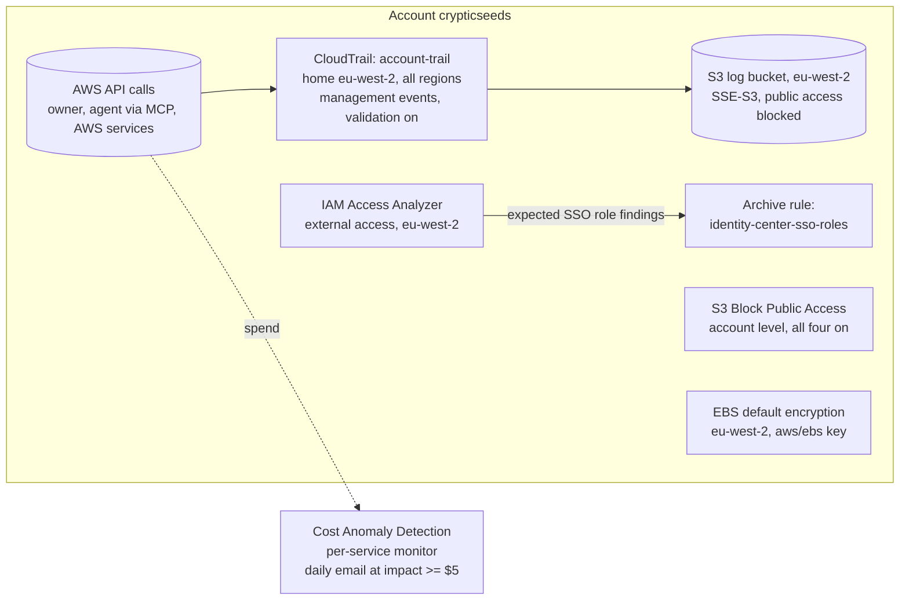

# Account baseline: five free guardrails before the first terraform apply

Journal entry 02 for the aws-platform project. Written 2026-10-03.

This records how Seeds (the owner) switched on the account-level guardrails that should exist before any infrastructure is built:

- an audit trail
- a check for anything shared outside the account
- a spend alarm that reacts to sudden jumps
- a ban on public S3 data
- encryption on every disk

Like journal 01, it is meant to be read three ways: as a blog draft, as interview evidence, and as a runbook to repeat the setup from scratch.

## TL;DR

- Five controls, all free or close to it, switched on in the console as `PlatformAdmin`. Each was then verified by the AI agent through the AWS MCP Server, using its read-only role (`AgentReadOnly`).
- **CloudTrail trail** `account-trail`: all regions, management events (read and write), log file validation on, logs kept in an S3 bucket in London.
- **IAM Access Analyzer** (external access) in eu-west-2. The only findings are the two Identity Center roles, which are trusted on purpose. An archive rule files those automatically.
- **Cost Anomaly Detection**: alerts by daily email when a service's spend breaks its normal pattern by $5 or more.
- **S3 Block Public Access** at account level, all four settings on.
- **EBS encryption by default** in eu-west-2, using the AWS-managed `aws/ebs` key.
- Deliberately skipped: GuardDuty, Security Hub and AWS Config. They cost money and add little to a short-lived, single-account portfolio project.

### What the account looks like now



## Why an account baseline is needed

Each of these controls is cheap to switch on now and expensive to wish you had switched on later. Each one answers a question you will eventually be asked, by an incident, an interviewer or your own bill.

| Control | The question it answers | What goes wrong without it |
|---|---|---|
| CloudTrail trail | "Who did what, when, and from where?" | AWS keeps only 90 days of event history, searchable only in the console. An incident found in month three has no record. You also cannot show what an AI agent did in a past session. |
| IAM Access Analyzer | "Can anyone outside this account reach my resources?" | A Terraform change adds a bucket policy or role trust that lets an outside party in. Nothing tells you until it is used. |
| Cost Anomaly Detection | "Did something start costing money today that normally doesn't?" | The project's cost plan is "destroy at the end of every session". The failure mode is forgetting once. A stack left running costs $5-7 a day, and fixed billing alarms take a week or more to notice. |
| S3 Block Public Access (account) | "Can any bucket be made public, ever?" | New buckets block public access by default, but any one bucket can switch it off. One wrong setting exposes data. |
| EBS encryption by default | "Is every disk encrypted, even if someone forgets to ask?" | A module or launch template without `encrypted = true` creates an unencrypted node disk. Encryption cannot be added to an existing volume in place. |

In a company these are part of the "landing zone": the guardrails an account gets before any team builds in it. Doing it by hand once, with reasons, is what makes the later Terraform version understandable.

## Key takeaways

1. **Guardrails go in before infrastructure.** An audit trail cannot log the past, and encryption by default cannot encrypt disks that already exist.
2. **An AI agent's activity is already in a standard trail.** Calls the agent makes through the AWS MCP Server are recorded as normal management events, tagged with `invokedBy: aws-mcp.amazonaws.com`. A free management-events trail captures them. Paid data events are only needed for object-level reads such as S3 `GetObject` (details in journal 01, "Auditing what the agent does").
3. **"Enabled" is not the same as "working".** Cost Anomaly Detection had been on in this account since 2023 with a confirmed email address. But its threshold ($100 and 40% in one anomaly) was one this account could never reach. Check the threshold, not just the toggle.
4. **Some findings are your own front door.** Access Analyzer flags the Identity Center roles as external access, because a federated identity provider can assume them. That is the access built on purpose in journal 01. Archive what you have judged, with a rule, so an active finding always means something new.
5. **Region is a one-way decision for some resources.** A trail's home region and a bucket's region cannot be changed. Check the console region before creating anything regional.
6. **Free controls cover the realistic mistakes.** For a single short-lived account, the paid services (GuardDuty, Security Hub, Config) mostly report on things that don't exist here. Spend first on the free controls that prevent the likely errors.

## Concepts in plain English

| Term | Meaning |
|---|---|
| CloudTrail event history | The free, built-in, 90-day searchable record of management events in each region. Exists in every account without setup. |
| Trail | A configuration that copies CloudTrail events into an S3 bucket you own, permanently. A multi-region trail covers every region from one place, its "home region". |
| Management event | A call that reads or changes the configuration of a resource: `CreateBucket`, `DescribeVpcs`, `AssumeRole`. The first copy of these in a trail is free. |
| Data event | A call on the data inside a resource: S3 `GetObject`/`PutObject`, Lambda `Invoke`. High volume, charged per event, off by default. |
| Log file validation | CloudTrail writes signed hourly "digest" files alongside the logs, so you can later prove the logs were not edited or deleted. |
| Recursive logging | A trail that logs S3 data events on its own bucket records its own log writes, which are logged in turn, without end. Only possible when data events are on. |
| IAM Access Analyzer (external access) | Reads the resource policies and role trust policies in the account. Reports anything that grants access to a principal outside the "zone of trust". It reasons over policy logic; it does not watch traffic. |
| Zone of trust | What the analyzer treats as "inside": either this account or the whole Organization. |
| Archive rule | A saved filter that automatically archives matching findings, so the active list only shows things you have not already judged. |
| Cost Anomaly Detection | A machine-learning model of normal daily spend per service. It flags spend that breaks the pattern and emails a summary. |
| S3 Block Public Access | Four switches that override any bucket policy or ACL that would make data public. At account level they apply to every current and future bucket. |
| EBS encryption by default | A per-region setting that encrypts every new EBS volume and snapshot automatically. |
| AWS-managed KMS key | A key AWS creates and manages for a service (here `aws/ebs`). Free, no key policy work, but cannot be shared with other accounts. |

## Step by step: what was done and why

Starting state, read by the agent through MCP before anything was changed:

| Control | State before |
|---|---|
| CloudTrail trail | None. Event history only |
| IAM Access Analyzer | None in eu-west-2 |
| Cost Anomaly Detection | One monitor and one daily email subscription, both from 2023. Threshold: impact >= $100 AND >= 40% |
| S3 account-level Block Public Access | Not configured |
| EBS encryption by default (eu-west-2) | Off |

All console work was done signed in through the access portal as `seeds-sso` > `PlatformAdmin`. After each control, the agent verified it through MCP as `AgentReadOnly/seeds-agent` before moving on.

**Before every regional step, check that the console's region selector says Europe (London).**

### 1. CloudTrail trail

**What it gives you:** a permanent, tamper-evident record of every API call in every region. That covers the owner's applies, the agent's reads, and anything AWS services do on your behalf.

CloudTrail > Trails > **Create trail**:

| Setting | Value | Why |
|---|---|---|
| Trail name | `account-trail` | Plain and permanent. It appears in ARNs and log file names. |
| Enable for all accounts in my organization | **Off** | This option appears because the account is the Organization's management account. With a single account, an organization trail only adds setup (trusted access, a broader bucket policy, an extra folder level) for no extra coverage. It can be switched on later if a member account is added. |
| Storage location | Create new S3 bucket, keep the suggested name `aws-cloudtrail-logs-<account>-<suffix>` | The name must not contain `tfstate`, or the agent's deny on state files (journal 01) would stop it reading logs. |
| Log file SSE-KMS encryption | **Off** (bucket uses SSE-S3) | Logs are still encrypted at rest. A dedicated KMS key costs about $1 a month, and the agent's `kms:Decrypt` deny would stop it reading the logs. |
| Log file validation | **On** | Tamper evidence for free. |
| SNS notification delivery, CloudWatch Logs | Off | No live alerting needed. CloudWatch Logs ingestion is charged. |
| Event type | **Management events**, API activity **Read** and **Write** | The first copy is free. It captures everything the owner and the agent do. |
| Exclude AWS KMS events / RDS Data API events | Unticked | Keep the full record. |
| Data events, Insights events, Network activity events | Off | All charged. Not needed for this account. |

Then **Create trail**. Trails created in the console are multi-region, and they include global service events (IAM, STS, Identity Center sign-ins).

**Recursive logging:** the trail's detail page shows "Recursive logging: Disabled". That only becomes a risk if S3 data events are turned on, including for the trail's own bucket. With management events only, CloudTrail's own log writes are never logged.

### 2. IAM Access Analyzer (external access)

**What it gives you:** an automatic check that no bucket, role, KMS key or other supported resource can be reached by anyone outside the account. It runs continuously, so every resource Terraform creates later is checked as soon as it exists.

IAM > **Access analyzer** > Analyzer settings > **Create analyzer**:

| Setting | Value | Why |
|---|---|---|
| Analysis type | **External access** | Free. Not *Unused access* or *Internal access*, which are charged per role or resource per month. |
| Name | `ExternalAccessAnalyzer` (the console default) | Analyzer names cannot be changed later, so set the one you want at creation. |
| Zone of trust | **Current account** | Single account. Choosing the organization would treat member accounts as trusted, and there are none. |

An analyzer is regional. This one covers resources in eu-west-2, plus IAM roles, which are global.

**First scan: two findings, both expected.** They were the two Identity Center roles, `AWSReservedSSO_PlatformAdmin_<id>` and `AWSReservedSSO_AgentReadOnly_<id>`. Their trust policy lets a SAML identity provider assume them:

```json
{
  "Effect": "Allow",
  "Principal": { "Federated": "arn:aws:iam::<account>:saml-provider/AWSSSO_<id>_DO_NOT_DELETE" },
  "Action": ["sts:AssumeRoleWithSAML", "sts:TagSession"],
  "Condition": { "StringEquals": { "SAML:aud": "https://signin.aws.amazon.com/saml" } }
}
```

Access Analyzer treats any federated identity provider as outside the account, because the identities live in another system rather than in IAM. Here that system is Identity Center, and this is exactly how the access portal turns a login into a role session. The findings were `isPublic: false`, and the only principal was the account's own Identity Center provider.

**Archive rule** (analyzer page > Archive rules > **Create archive rule**):

| Field | Value |
|---|---|
| Rule name | `identity-center-sso-roles` |
| Criterion 1 | Resource type - Is - IAM role |
| Criterion 2 | Federated user - Contains - `AWSSSO_` |

Click **Create and archive active findings**, not *Create rule*. The second only applies to future findings and would leave the current two active. The rule also covers the role created for any permission set added later. From now on, an active finding is always something new and worth reading.

### 3. Cost Anomaly Detection

**What it gives you:** an email within a day when a service starts costing more than its usual pattern. This complements fixed billing alarms. Those fire on the monthly total ("this month is expensive"). This fires on a change ("something new started costing money today").

The account already had it from 2023:

- Monitor `Default-Services-Monitor`, which tracks each AWS service separately. That is the right type for one account.
- Subscription `Default-Services-Subscription`: daily email, recipient confirmed.

Its threshold, at least $100 AND at least 40% in one anomaly, meant it would never fire for a project spending a few dollars a day. Retuned:

Billing and Cost Management > **Cost Anomaly Detection** > **Alert subscriptions** > `Default-Services-Subscription` > **Edit**:

| Setting | Value | Why |
|---|---|---|
| Threshold | **Total impact amount above $5**, percentage condition removed | Sized to the real failure mode: a forgotten EKS control plane, NAT gateway and ALB at $5-7 a day. The percentage is measured against an expected spend close to zero, so it adds nothing. |
| Frequency | **Daily summaries** | Immediate alerts need an SNS topic. A day's delay is fine for this risk. |

If the account has no monitor yet: Cost monitors > Create monitor > **AWS services**, then create a subscription as above.

Expect the model to need about 10 days of history before it judges anything. Expect a little noise while the destroy-and-rebuild pattern is new. If it gets annoying, raise the threshold to $10.

### 4. S3 Block Public Access, account level

**What it gives you:** a guarantee that no bucket in the account, now or later, can serve data publicly through a bucket policy or ACL, whatever an individual bucket's settings say.

Before switching it on, check that no bucket is meant to be public. Here the only other bucket, `devopsfoundry` (from 2024), was empty and private, with no website configuration, and already blocked at bucket level.

S3 > **Account and organization settings** (further down the left menu; direct link https://console.aws.amazon.com/s3/settings) > **Block Public Access settings for this account** > **Edit** > tick **Block all public access** > **Save changes** > type `confirm`.

The same page also offers organization-level Block Public Access policies. Those are for member accounts and don't apply to a single-account setup.

### 5. EBS encryption by default (eu-west-2)

**What it gives you:** every new disk and snapshot in London is encrypted, including the EKS node disks Terraform will create, without anyone having to remember. There is no performance cost.

EC2 (console on London) > **Dashboard** > Account attributes > **Data protection and security** > EBS encryption > **Manage** > tick **Enable** > default key **`alias/aws/ebs`** > **Update EBS encryption**.

| Choice | Why |
|---|---|
| AWS-managed `aws/ebs` key | Free, and EC2 and EKS can use it with no key policy work. A customer-managed key ($1 a month) is mainly needed to share encrypted snapshots with another account, which this project never does. |
| London only | The setting is per region, and nothing in this project runs outside eu-west-2. |

It only applies to volumes created after it is switched on. No volumes existed, so nothing needed re-encrypting.

## Decisions and trade-offs

| Decision | Alternatives considered | Why |
|---|---|---|
| Account trail, not an organization trail | Organization trail from the management account | Single account. In a company, the organization trail is the norm because a member account's admin then cannot switch it off. |
| Management events only | Add S3 or other data events | The agent's MCP calls are already captured as management events. Data events are charged per event and bring the recursive-logging risk. |
| SSE-S3 on the log bucket | SSE-KMS with a dedicated key (CIS benchmark recommendation) | Saves about $1 a month and keeps the logs readable by the agent, whose role denies `kms:Decrypt`. In a company account, KMS's second permission check on log reads is worth paying for. |
| No CloudWatch Logs or SNS on the trail | Real-time log alerting | Charged, and nobody watches an alert channel for a portfolio account. The trail is for after-the-fact audit. |
| Access Analyzer external access only | Add unused access and internal access analysis | Both are charged per resource per month. External access is the one that catches a public bucket or a cross-account role. |
| Archive rule for SSO roles | Archive the findings by hand | Each future permission set creates a new `AWSReservedSSO_*` role. The rule files them automatically, so an active finding always means something new. |
| Anomaly threshold $5 absolute | $100 AND 40%; a percentage threshold | Matches the real failure mode. A percentage is meaningless against a near-zero baseline. |
| Account-level Block Public Access | Organization-level S3 policy; bucket-level only | Bucket-level is the default for new buckets, but any single bucket can opt out. Account-level removes that option. The organization policy is for member accounts. |
| `aws/ebs` AWS-managed key | Customer-managed KMS key | Free, no key policy to maintain. Cross-account snapshot sharing, the main reason for a customer key, is out of scope. |
| Skip GuardDuty, Security Hub, AWS Config | Turn them on for the free trials | Each bills after its trial and mostly reports on things this small account doesn't have. Worth revisiting if the account becomes long-lived or multi-account. |

## Gotchas

- **Console region decides where regional resources live.** A trail created while the console is on another region gets that region as its home, and its new bucket lands there too. Neither can be changed afterwards. The only fix is to delete the trail, empty and delete the bucket, and recreate. Check the region selector first.
- **Organization options appear in a management account.** "Enable for all accounts in my organization", the organization zone of trust and S3 organization-level policies are all for multi-account setups. Leave them off in a single account.
- **Use "Create and archive active findings" for a new archive rule.** *Create rule* alone leaves existing findings active.
- **Analyzer names are permanent.** Type the name you want before clicking Create.
- **S3 account settings live under "Account and organization settings".** Older guides refer to a "Block Public Access settings for this account" menu item. The current menu groups it under Account and organization settings.
- **New findings take a few minutes.** Access Analyzer's first scan of a new analyzer is not instant. Check findings again a few minutes after creating it.
- **A cost model needs history.** Cost Anomaly Detection judges spend against roughly 10 days of history, so a brand-new account or service gets no useful alerts at first.

## Verification evidence

All read through the MCP server's `run_script` as `AgentReadOnly/seeds-agent` on 2026-10-03 (times UTC).

| Control | Check | Result |
|---|---|---|
| CloudTrail | `DescribeTrails` | `account-trail`, home region `eu-west-2`, multi-region `true`, organization trail `false`, global service events `true`, log file validation `true`, no KMS key |
| CloudTrail | `GetEventSelectors` | One selector: `eventCategory = Management` (read and write) |
| CloudTrail | `GetTrailStatus` | `IsLogging: true` since 00:20. First log delivered 00:32, latest 01:16 at last check. First digest 00:21. No delivery errors |
| CloudTrail | Log bucket | Region `eu-west-2`, SSE-S3 (`AES256`), bucket-level public access blocked (all four), 14 log files for eu-west-2 at last check |
| CloudTrail | Agent calls recorded as management events | Event history (`LookupEvents`, management events only) lists MCP-invoked `DescribeVpcs`, `ListBuckets`, `GetCallerIdentity` with `invokedBy: aws-mcp.amazonaws.com`, plus `CallReadWriteTool` from `aws-mcp.amazonaws.com` |
| Access Analyzer | `ListAnalyzers` (eu-west-2) | `ExternalAccessAnalyzer`, type `ACCOUNT`, status `ACTIVE` |
| Access Analyzer | `ListArchiveRules` | `identity-center-sso-roles`: `resourceType eq AWS::IAM::Role`, `principal.Federated contains AWSSSO_` |
| Access Analyzer | `ListFindingsV2` | 2 findings (the two SSO roles), both `ARCHIVED`. 0 active |
| Cost Anomaly Detection | `GetAnomalySubscriptions` | Frequency `DAILY`, threshold `ANOMALY_TOTAL_IMPACT_ABSOLUTE >= 5`, one email subscriber, `CONFIRMED` |
| Cost Anomaly Detection | `GetAnomalyMonitors` | `Default-Services-Monitor`, `DIMENSIONAL` by `SERVICE` |
| S3 Block Public Access | `s3control:GetPublicAccessBlock` (account) | `BlockPublicAcls`, `IgnorePublicAcls`, `BlockPublicPolicy`, `RestrictPublicBuckets` all `true`. Before: `NoSuchPublicAccessBlockConfiguration` |
| EBS encryption | `GetEbsEncryptionByDefault` (eu-west-2) | `true`. Before: `false` |
| EBS encryption | `GetEbsDefaultKmsKeyId` + `kms:DescribeKey` | Key manager `AWS`, alias `alias/aws/ebs`, `Enabled` |

Not yet verified:

- The contents of a delivered log file were not inspected. Delivery status and event history show the trail is working and that agent calls are management events.
- No Cost Anomaly Detection alert has fired. The model needs history, and nothing anomalous has happened.
- No EBS volume exists yet to show encryption applied in practice. The first EKS node group will show it (`Encrypted: true` on the node volumes).
- Block Public Access was not tested by trying to make a bucket public.

## Cost

| Control | Cost |
|---|---|
| CloudTrail trail (first copy of management events) | Free. S3 storage for the logs: pennies a month at this account's volume |
| IAM Access Analyzer, external access | Free |
| Cost Anomaly Detection | Free |
| S3 Block Public Access | Free |
| EBS encryption by default with `aws/ebs` | Free |

Not measured yet: the actual S3 storage cost of the trail. Check it in Cost Explorer after the first month.

## Checking the baseline later

```
CloudTrail > Trails > account-trail          # Logging; Multi-region: Yes; last log file delivered recently
IAM > Access analyzer > Findings             # Active: 0. Anything active is new and worth reading
Billing > Cost Anomaly Detection             # Subscription: $5 threshold, daily
S3 > Account and organization settings       # Block all public access: On
EC2 (London) > Dashboard > Data protection   # EBS encryption: Enabled, aws/ebs
```

Or ask the agent to re-run the reads in the Verification evidence table through MCP.

## Repeat from scratch

Sign in as `PlatformAdmin`. Before every regional step, check the console region says Europe (London).

1. CloudTrail > Create trail `account-trail`. Organization: off. New S3 bucket (name without `tfstate`). SSE-KMS: off. Log file validation: on. SNS and CloudWatch Logs: off. Management events, Read and Write. No data, Insights or network activity events.
2. IAM > Access analyzer > Create analyzer. External access, zone of trust current account, choose the name now.
3. After the first scan, create archive rule `identity-center-sso-roles`: Resource type is IAM role, Federated user contains `AWSSSO_`. Use **Create and archive active findings**. Confirm 0 active findings.
4. Billing > Cost Anomaly Detection. If there is no monitor, create an AWS services monitor. Subscription: daily email, threshold total impact above $5.
5. S3 > Account and organization settings > Block Public Access for this account > Block all public access.
6. EC2 (London) > Dashboard > Data protection and security > EBS encryption > Enable, key `aws/ebs`.
7. From the agent, verify each with the reads in the Verification evidence table.

## Open items and next steps

- **Codify the baseline in Terraform** once the bootstrap root exists. Import the trail, log bucket, analyzer and archive rule, account-level Block Public Access, EBS default encryption and the anomaly subscription, so they are code rather than console settings. Everything is in eu-west-2 (billing is global), so a single regional provider is enough.
- Optional: an S3 lifecycle rule on the log bucket (for example, move to a cheaper storage class after 90 days, or expire after a year). Not needed at current volume.
- Optional: delete the empty `devopsfoundry` bucket from 2024.
- Still open from journal 01: the console write-denial test result, retiring the `devopsfoundry` IAM user's console access, the agent's Kubernetes RBAC, and testing the `kms:Decrypt` and `*tfstate*` denies once the state bucket exists.
- Revisit GuardDuty, Security Hub and AWS Config if the account becomes long-lived or gains member accounts.

## References

- Creating a trail in the console: https://docs.aws.amazon.com/awscloudtrail/latest/userguide/cloudtrail-create-a-trail-using-the-console-first-time.html
- CloudTrail concepts (management, data and Insights events): https://docs.aws.amazon.com/awscloudtrail/latest/userguide/cloudtrail-concepts.html
- CloudTrail log file integrity validation: https://docs.aws.amazon.com/awscloudtrail/latest/userguide/cloudtrail-log-file-validation-intro.html
- CloudTrail pricing: https://aws.amazon.com/cloudtrail/pricing/
- Logging AWS MCP Server API calls with CloudTrail: https://docs.aws.amazon.com/agent-toolkit/latest/userguide/logging-using-cloudtrail.html
- Secure AI agent access patterns to AWS resources using MCP (AWS Security Blog): https://aws.amazon.com/blogs/security/secure-ai-agent-access-patterns-to-aws-resources-using-model-context-protocol/
- Create an IAM Access Analyzer external access analyzer: https://docs.aws.amazon.com/IAM/latest/UserGuide/access-analyzer-create-external.html
- Access Analyzer archive rules: https://docs.aws.amazon.com/IAM/latest/UserGuide/access-analyzer-archive-rules.html
- Cost Anomaly Detection: https://docs.aws.amazon.com/cost-management/latest/userguide/manage-ad.html
- S3 Block Public Access: https://docs.aws.amazon.com/AmazonS3/latest/userguide/access-control-block-public-access.html
- Configuring account-level S3 Block Public Access: https://docs.aws.amazon.com/AmazonS3/latest/userguide/configuring-block-public-access-account.html
- EBS encryption by default: https://docs.aws.amazon.com/ebs/latest/userguide/encryption-by-default.html
- AWS Security Reference Architecture (where these controls sit in a multi-account setup): https://docs.aws.amazon.com/prescriptive-guidance/latest/security-reference-architecture/introduction.html

## Appendix A: social post draft

> Before building anything on AWS, I switched on five free account guardrails: a CloudTrail trail, IAM Access Analyzer, cost anomaly alerts, account-wide S3 Block Public Access and EBS encryption by default.
>
> Three takeaways:
> - My cost anomaly alerts had been "on" for three years with a threshold this account could never reach. Check the threshold, not the toggle.
> - Access Analyzer flags Identity Center roles as external access, because a federated provider can assume them. That's the front door you built. Archive it with a rule, and any active finding is genuinely new.
> - My AI agent's calls through the AWS MCP Server show up in CloudTrail as ordinary management events, tagged with the MCP service. A free trail is enough to audit what the agent did.
>
> Each control was verified by the agent itself, using a read-only role. Write-up in the repo.

## Appendix B: blog title ideas

1. Five free AWS guardrails to switch on before your first terraform apply
2. My cost alerts were on for three years and could never fire
3. What my AI agent's AWS calls look like in CloudTrail
4. Account baseline for a portfolio AWS account: what I enabled, what I skipped and why
