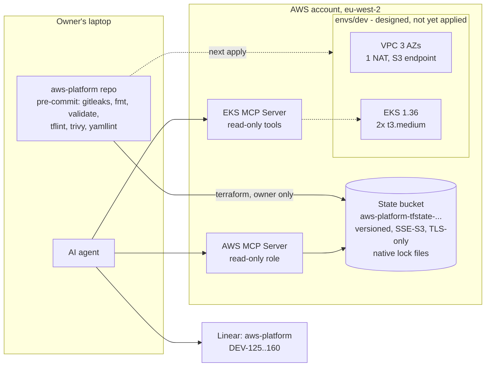

# Terraform foundation: tracking, guardrails, state and the first cluster design

Journal entry 03 for the aws-platform project. Written 2026-10-04, covering the sessions of 2026-10-03 and 2026-10-04. Extended on 2026-10-07 with the work merged between 2026-10-05 and 2026-10-06 (steps 11 to 18). This is a living document for the rest of P1 and is finalised at the close-out (DEV-147): see [Draft status](#draft-status-todo-at-close-out). The criteria table is in [03-p1-closeout-table.md](03-p1-closeout-table.md).

This records how Seeds (the owner) and the AI agent went from "account secured, no code" to "Terraform repo with safety rails, a live state bucket, and a reviewed VPC + EKS design ready to apply":

- where the work is tracked, and what "done" means
- read-only Kubernetes access for the agent through a second MCP server
- a public repo that cannot easily leak a secret or an account ID
- the remote state bucket, created and then made to hold its own state
- a state, tagging and layering strategy that scales to future projects
- the dev network and EKS cluster, with each design choice explained

Like journals 01 and 02, it is meant to be read three ways: as a blog draft, as interview evidence, and as a runbook to repeat the setup from scratch. Many sections teach the concept as well as recording the choice, because the owner is relearning Terraform through this project.

## TL;DR

- **Tracking:** all work lives in the Linear project `aws-platform` (issues DEV-125 to DEV-160, milestones P1-P4). A shared Definition of Done says what counts as finished: evidence for every criterion, offline checks, owner applies and agent verifies, a second `terraform plan` showing `No changes.`, tags on everything, cost hygiene. The repo holds only lasting artefacts.
- **Agent access to EKS:** a second MCP server (`eks`, the managed Amazon EKS MCP Server) using the same `agent-readonly` SSO login, proxy flag `--read-only`, and the AWS managed policy `AmazonEKSMCPReadOnlyAccess` on the `AgentReadOnly` permission set. Write tools are not offered and would be denied by IAM even if they were.
- **Safety rails:** `.gitignore` for state, real tfvars, keys, kubeconfigs and plan files; pre-commit with gitleaks, terraform fmt/validate, tflint (AWS ruleset), trivy and yamllint. The gitleaks hook was proven to block a staged fake token.
- **State:** one account-wide S3 bucket (`aws-platform-tfstate-...`, tagged `Scope=shared`) with versioning, SSE-S3, Block Public Access, a TLS-only policy, 30-day retention of old versions and **S3-native locking** (no DynamoDB). Bootstrapped with local state, then migrated into itself. The agent was proven unable to read state.
- **Strategy:** one bucket, one state key per project and layer (`<project>/<env>/...`). Tags `Project`, `Application`, `Environment`, `ManagedBy`, `Repository` on everything. Layers: `bootstrap/` (account), `envs/<env>/` (shared platform), `apps/<app>/<env>/` (app-owned AWS resources).
- **Dev platform (designed, not yet applied):** VPC across 3 AZs, private /20s for nodes, public /24s, one NAT gateway, a free S3 gateway endpoint; EKS 1.36 with access entries only, Pod Identity, AWS-owned envelope encryption, public endpoint limited to the owner's IP, two `t3.medium` nodes.
- **Next direction:** Argo CD on the owner's Raspberry Pi 5 k3s cluster as a hub, and a private-only EKS endpoint over Tailscale (DEV-155).

### What exists now



## Why this phase matters

Journals 01 and 02 secured the account. This phase decides how infrastructure gets built in it, and those decisions are expensive to change later:

| Decision area | Question it answers | What goes wrong if it is skipped |
|---|---|---|
| Tracking and Definition of Done | "How do we know a task is really finished?" | Work is reported done on intent. A cluster "works" but nobody checked the second plan, the tags or the teardown. |
| Repo safety rails | "Can this public repo leak something?" | A tfvars file, a plan file or a pasted token lands in git history, which is permanent in a public repo. |
| Remote state | "Where does Terraform remember what it built, and who can read it?" | State on a laptop is lost or corrupted; two applies run at once; anyone who can read state can read every secret Terraform touched. |
| State, tag and layer strategy | "Can a second project reuse this without a mess?" | Every new project copies code, shares one giant state file, and its costs blur into everything else. |
| Network and cluster design | "Will the cluster scale, stay reachable and stay cheap?" | Pods run out of IP addresses, load balancers never appear, or a $1 key is left behind after every destroy. |

## Key takeaways

1. **Define "done" before writing code.** Each issue lists its checks with the exact command that proves them. That turned "it applied" into "it applied, a second plan is empty, and the agent confirmed it through a read-only API".
2. **An empty passing hook proves nothing.** The gitleaks hook passed with nothing staged. Only staging a fake token and watching it fail proved it worked.
3. **Bootstrap is a chicken-and-egg problem with a standard answer.** Apply the state bucket with local state, then move that state into the bucket it just created.
4. **DynamoDB locking for the S3 backend is deprecated.** Terraform 1.10+ writes a `.tflock` object next to the state instead.
5. **Tags only help if they reach every resource.** `default_tags` misses resources AWS creates on your behalf (node instances, their disks, load balancers made by a controller). Pass tags into those explicitly.
6. **Read the official docs before inventing a fix.** Twice in this phase a simple documented answer (or a ten-second test) beat a clever workaround.
7. **Humans rarely `kubectl` production.** Mature teams change clusters through GitOps and keep human access read-only with a logged break-glass path. That shapes how the endpoint question is answered.

## Concepts in plain English

| Term | Meaning |
|---|---|
| Terraform state | Terraform's memory of what it built: a JSON file mapping your code to real resource IDs. It can contain secrets, so access to it must be tight. |
| Backend | Where state is stored. Here: S3. |
| State lock | A marker that stops two `terraform apply` runs changing the same state at once. With `use_lockfile = true`, Terraform writes `<key>.tflock` in the bucket while it runs. |
| Root module / root | A folder you run `terraform init/plan/apply` in, with its own state: `bootstrap/`, `envs/dev/`. |
| Module | Reusable Terraform code called by a root: `modules/network`, `modules/cluster`, and the community modules they wrap. |
| `default_tags` | A provider setting that adds the same tags to every resource Terraform creates directly. |
| Lock file (`.terraform.lock.hcl`) | Records the exact provider versions and checksums a root uses, so every machine and CI run gets the same verified provider. |
| Pre-commit hook | A check that runs automatically on `git commit` and blocks the commit if it fails. |
| Envelope encryption | Data is encrypted with a data key, and that data key is encrypted with a key in AWS KMS. |
| CMK | Customer-managed KMS key: a key you own, with your own key policy and audit trail. |
| IRSA / Pod Identity | Two ways to give a Kubernetes pod AWS permissions without giving it the node's role. |
| VPC CNI | The default EKS network plugin. It gives every pod a real VPC IP address. |
| NAT gateway | Lets private subnets start connections out to the internet. Nothing can start a connection in through it. |
| Access entry | EKS's API-based way to map an IAM principal to Kubernetes permissions (replaces the old `aws-auth` ConfigMap). |
| Cost allocation tag | A tag key you activate in Billing so Cost Explorer can group spend by it. |

## Step by step: what was done and why

### 1. Choose where work is tracked: Linear plus repo docs

**What:** a Linear project `aws-platform` in the Devopsfoundry team, milestones P1-P4, 36 issues. P1 issues are detailed and in Todo. P2-P4 are outlines in Backlog with a `Needs refinement` label. A label `Owner action` marks steps only the owner can run (applies, console, secrets).

**Why:** Linear gives status, order (blocking relations) and an API the agent can read and update. Markdown task lists in the repo have none of that, and mirroring both drifts. The repo keeps only things worth keeping: code, ADRs, runbooks, journals.

**The Definition of Done (project-level, applies to every issue):** every criterion ticked with evidence; offline checks pass; live state checked twice (owner runs, agent confirms through the read-only MCP); a second `terraform plan` says `No changes.`; no account ID, secret or personal identifier in the diff; delivered through a reviewed PR; docs updated; tagged for cost tracking; numbers measured, not configured; stack destroyed at session end or a reason recorded.

**Decisions recorded along the way:** keep the account's $1/$10/$20 budgets as early-warning defaults and add $50/$100 later (DEV-126, deferred); drop the old handoff's "Fable" status file.

### 2. Fix the AWS MCP server, then add the EKS MCP server

**The fix:** the `aws` MCP server failed with `CONNECTION_CLOSED`. The cause was in its own log: `unrecognized arguments: True`. `--disable-telemetry` is an on/off flag that takes no value, so the extra `"True"` crashed the proxy at startup. Removing it fixed the server. Lesson: read the server log before blaming credentials.

**The requirement:** pasting `kubectl` output back and forth is too slow. The agent must be able to list, describe and read logs on its own, with no writes and no Secret reads.

**The problem:** `kubectl` against EKS needs AWS credentials (`aws eks get-token`). The agent's credentials sit in the SSO cache, which the sandbox blocks on purpose because the same folder holds the owner's admin token.

**The answer:** the managed Amazon EKS MCP Server, reached through the same proxy and the same `agent-readonly` profile. No second SSO session.

```json
"eks": {
  "command": "uvx",
  "args": ["mcp-proxy-for-aws-cli==1.7.0", "https://eks-mcp.eu-west-2.api.aws/mcp",
           "--service", "eks-mcp", "--profile", "agent-readonly",
           "--region", "eu-west-2", "--read-only", "--disable-telemetry"]
}
```

**Permissions:** `ReadOnlyAccess` already includes `eks:AccessKubernetesApi`, but not `eks-mcp:InvokeMcp` or `eks-mcp:CallReadOnlyTool`. The owner attached the AWS managed policy `AmazonEKSMCPReadOnlyAccess` to the `AgentReadOnly` permission set. It does not include `eks-mcp:CallPrivilegedTool`.

**Three independent layers stop writes:** the proxy's `--read-only` hides write tools; IAM denies privileged tools; Kubernetes RBAC (an access entry mapped to a no-Secrets, no-write ClusterRole, still to be applied in DEV-136) limits what reads return.

### 3. Scaffold the repo with safety rails

**What:**

- `.gitignore` additions: real `*.tfvars` (with `!*.tfvars.example`), `*.tfplan`, `*.pem`, `*.key`, `.env*` (with `!.env.example`), `kubeconfig*`, local agent settings, `.DS_Store`, and `modules/**/.terraform.lock.hcl`.
- `.pre-commit-config.yaml`: merge-conflict, end-of-file, whitespace, JSON and private-key checks; gitleaks; terraform fmt, validate and tflint (from `antonbabenko/pre-commit-terraform`); trivy; yamllint. Each repo pinned with `pre-commit autoupdate`.
- `.tflint.hcl` with the AWS ruleset pinned (0.49.0), `.yamllint.yaml`, README, `docs/decisions/`, `docs/runbooks/`.
- Tools installed: gitleaks, tflint (from `terraform-linters/tap`), yamllint, pre-commit, trivy.

**Why:** the repo is public from the first commit. Anything committed stays in history even after deletion. The cheapest leak to fix is the one that never gets committed.

**Proving gitleaks works:** in a throwaway repo with the same config, a staged file containing a randomly generated fake `ghp_` token made the hook fail with `RuleID: github-pat` and the secret shown as `REDACTED`.

### 4. Bootstrap the state bucket

**What:** the `bootstrap/` root creates one S3 bucket, using `bucket_prefix = "aws-platform-tfstate-"` so AWS appends a unique suffix and no account ID appears in the name.

| Setting | Value | Why |
|---|---|---|
| Name contains `tfstate` | enforced by variable validation | The agent's IAM deny on `s3:GetObject` targets `*tfstate*` buckets |
| `prevent_destroy` | true | Losing the state bucket orphans every project's state |
| Object ownership | `BucketOwnerEnforced` | ACLs off; only policies decide access |
| Block Public Access | all four on | Belt and braces with the account-level setting from journal 02 |
| Versioning | on | Every state write is kept; a bad apply can be rolled back |
| Encryption | SSE-S3 (AES256) | Free and transparent; see the trade-off table |
| Lifecycle | old versions expire after 30 days; incomplete uploads aborted after 7 | A month to notice and roll back; state files are small |
| Bucket policy | deny any request where `aws:SecureTransport = false` | TLS only |
| Locking | `use_lockfile = true` in each backend | S3-native locking |

**How it ran:**

1. Owner applied with local state (7 resources).
2. The owner then asked for 30-day retention and a shared-scope tag. Both were in-place changes, so no destroy was needed (and `prevent_destroy` would have refused one).
3. The agent added `bootstrap/backend.tf` pointing at the new bucket with key `bootstrap/terraform.tfstate`.
4. Owner ran `terraform init -migrate-state`, answered `yes`, applied the two in-place changes, and a second plan printed `No changes.`
5. Owner deleted the now-unused local state files.

### 5. Decide the multi-project strategy

The owner's goal: this account will host more projects later, and each must be trackable on its own, even after it is deleted.

**State layout:** one bucket per account, one state file per project and layer.

```
bootstrap/terraform.tfstate                               this bucket's own state
aws-platform/dev/terraform.tfstate                        shared platform (envs/dev)
aws-platform/dev/apps/concurrent-job-queue/terraform.tfstate   app-owned resources (P2)
<next-project>/<env>/terraform.tfstate                    a future project
```

Each project has its own lock, so a destroy in one can never touch another. Future projects write their own Terraform and only point their backend at this bucket with a new key.

**Tags (on every resource):**

| Tag | Example | Purpose |
|---|---|---|
| `Project` | `aws-platform` | The initiative. Stays visible in Cost Explorer after the project is gone. |
| `Application` | `platform`, `concurrent-job-queue` | Shared infra vs the workload a resource serves |
| `Environment` | `dev`, `shared` | |
| `ManagedBy` | `terraform` | Code vs clicked |
| `Repository` | `github.com/crypticseeds/aws-platform` | Where the code lives |

The bucket also carries `Scope=shared` because every project uses it. No `Owner` tag: it adds nothing in a single-owner account (in a team it would name the owning team).

**Layers:**

```
Layer 1  bootstrap/            state bucket (later: account baseline, GitHub OIDC)   once per account
Layer 2  envs/<env>/           VPC, EKS, add-ons (Application=platform)             per environment
Layer 3  apps/<app>/<env>/     an app's RDS, Redis, IAM roles (Application=<app>)    per app, own state
         + Kubernetes manifests deployed by Argo CD
```

App roots look up platform values (VPC, subnets, node security group) with data sources by tag, not `terraform_remote_state`, which the Terraform skill advises keeping for true ownership boundaries only.

### 6. Design the dev network (`modules/network`)

A thin wrapper around `terraform-aws-modules/vpc/aws` 6.7.3:

- 3 AZs; private subnets `cidrsubnet(vpc_cidr_block, 4, i)` (/20s), public subnets `cidrsubnet(vpc_cidr_block, 8, 48 + i)` (/24s) from `10.20.0.0/16`.
- One NAT gateway shared by all AZs.
- Subnet discovery tags: `kubernetes.io/role/elb` (public), `kubernetes.io/role/internal-elb` (private).
- A free S3 gateway endpoint on the private route tables.

The reasons for each are in [Best practices learned](#best-practices-learned).

### 7. Design the dev cluster (`modules/cluster`)

A thin wrapper around `terraform-aws-modules/eks/aws` 21.26.0:

- Kubernetes **1.36**: the EKS default on 2026-10-04, in standard support until 2027-08. The newest (1.37) was skipped so add-on charts can catch up.
- `authentication_mode = "API"`, `enable_cluster_creator_admin_permissions = false`, and one access entry granting `AmazonEKSClusterAdminPolicy` to the `PlatformAdmin` SSO role. The role is looked up by name under `/aws-reserved/sso.amazonaws.com/` and its real ARN, path included, is used as-is. Access entries accept paths; only the legacy `aws-auth` ConfigMap did not (see Gotchas).
- Public endpoint on but limited to `endpoint_public_access_cidrs` (no default; `0.0.0.0/0` rejected by validation); private endpoint on for nodes.
- `enable_irsa = false` (Pod Identity instead), `create_kms_key = false`, `encryption_config = null` (AWS-owned envelope encryption).
- Control-plane logs: `audit` and `authenticator`, 7-day retention.
- Add-ons: `vpc-cni` and `eks-pod-identity-agent` before nodes join (`before_compute = true`), then `kube-proxy`, `coredns`.
- Node group: 2x `t3.medium` (min 2, max 3), AL2023, IMDSv2 required (module default).
- `tags` passed into the module, so the node launch template tags instances and their volumes.

The module source was read at the pinned version to confirm that `encryption_config = null` really disables the CMK, `enable_irsa = false` skips the OIDC provider, and the launch template merges `var.tags`.

### 8. Security scanning with trivy

Trivy (HIGH and CRITICAL only) found four issues in our code, all deliberate. Each is accepted with an inline comment next to the code it applies to, so a reviewer sees the reason where it matters:

| Finding | Where | Why it is accepted |
|---|---|---|
| AWS-0132 no customer-managed key | state bucket encryption | SSE-S3 by design; the agent is denied reading state separately |
| AWS-0039 secrets encryption not enabled | EKS | EKS envelope-encrypts all API data by default (AWS-owned key); the check predates that |
| AWS-0040 public cluster endpoint | EKS | Needed for the owner's kubectl, limited to the owner's IP |
| AWS-0104 unrestricted egress | node security group | Nodes need outbound access through the NAT for image pulls and AWS APIs |

It also flagged a Deployment called `inflate` inside the downloaded EKS module's examples. That is not our code, so the hook skips `**/.terraform` and `**/*.tfplan`.

### 9. Owner shell shortcuts

Added to the owner's dotfiles (`zsh/.config/zsh/aliases.zsh`). Runbooks always show the standard command first, so readers without the dotfiles can follow along.

| Shortcut | Standard command |
|---|---|
| `aws-admin-login` | `aws sso login --profile platform-admin --color on` |
| `aws-agent-login` | `aws sso login --profile agent-readonly --no-browser --color on` |
| `aws-admin-identity` | `aws sts get-caller-identity --profile platform-admin` |
| `aws-agent-identity` | `aws sts get-caller-identity --profile agent-readonly` |
| `aws-admin-logout` | removes only the admin's SSO token file and derived role credentials, then `unset AWS_PROFILE` |
| `tf`, `tfi`, `tfv`, `tff`, `tfp`, `tfa`, `tfo`, `tfsl` | `terraform`, `init`, `validate`, `fmt -recursive`, `plan`, `apply`, `output`, `state list` |

There is deliberately no alias for `destroy`.

### 10. Cluster access and the Raspberry Pi direction (discussed, not built)

See [How teams reach private clusters](#how-teams-reach-private-clusters) for the options. The decision for now: keep the public endpoint with an IP allowlist for the first apply, because it is already built and free. Then, in DEV-155:

- run Argo CD on the owner's Raspberry Pi 5 k3s cluster as a hub that manages EKS (it survives every EKS destroy, keeps Argo off the nodes, and can serve other projects);
- make the EKS endpoint private and reach it over Tailscale (the Pi is already on the owner's tailnet) through a subnet router in the VPC;
- give Argo a machine identity, not SSO.

### 11. Write down the decisions as ADRs (DEV-128, PR #2)

**What:** eleven architecture decision records in `docs/decisions/` (0001 to 0011): single account, Identity Center and a read-only agent, community modules, single NAT, S3-native locking, Docker Hub instead of ECR, plan-only CI, tagging and layering, EKS security choices, multi-project state layout, and (with DEV-141) installing Argo CD by Helm.

**Why:** a decision that lives only in a chat or a journal is hard to find and easy to reverse by accident. An ADR holds the context, the decision and the alternatives in one short file a reviewer can link to. The "Decisions and trade-offs" table below stays as the summary and links out.

### 12. Plan-only CI: the OIDC role and the plan workflow (DEV-133, DEV-135)

**What:**

- `account/` is a new permanent Terraform root (its own state key, never destroyed) holding the GitHub OIDC provider and the role `aws-platform-ci-plan` (PR #9). Because it lives outside `envs/dev`, the role survives every cluster destroy ([ADR 0010](../decisions/0010-multi-project-state-layout.md)).
- The role trusts only GitHub's OIDC provider, with audience `sts.amazonaws.com` and a subject limited to pull requests of this repository. It gets `ReadOnlyAccess`, read access to the state bucket, and write access to `*.tflock` keys only, so a plan can take the lock but cannot change state. Maximum session one hour.
- `.github/workflows/terraform-plan.yml` (PR #17) runs `terraform plan` for `bootstrap`, `account` and `envs/dev` on pull requests that touch `*.tf`, and posts one comment per root, updated in place. There is no `apply` anywhere in CI ([ADR 0007](../decisions/0007-plan-only-ci.md)).
- Leak protection added during review: the account ID is masked in logs and replaced by `<account-id>` in the comment, and `endpoint_public_access_cidrs` is marked `sensitive` so the owner's IP does not print in the `envs/dev` plan. Plans take the state lock like everyone else (an early draft used `-lock=false`, which was removed).

**Why:** a plan in the pull request lets a reviewer see what Terraform would change before merging. OIDC means GitHub proves who it is to AWS per run, so no access key is stored in GitHub. Giving the role no write access except to lock files means a compromised workflow cannot change infrastructure.

### 13. Static checks in CI (DEV-163, PR #8)

**What:** `.github/workflows/checks.yml` runs the pre-commit hooks, Helm lint with kubeconform, actionlint, and scanners (checkov, trivy, Snyk) on every pull request, with no AWS credentials. The scanners are advisory, as the DEV-163 decision stated; the pre-commit, chart and actionlint jobs gate.

**Why:** the local pre-commit hooks only protect the machines that have them installed. The same checks in CI protect the public repo from every contributor, including the agent on another machine.

### 14. Helm charts for the two apps (DEV-139, DEV-140, PRs #3 and #5)

**What:** `charts/sre-inference-gateway` and `charts/promscope`. The image repository and tag are `required` and empty in `values.yaml`, so rendering fails until a real image is set; the Argo Applications set them. Lint and kubeconform use `ci/test-values.yaml`, a throwaway image that only the checks use. The gateway runs as a fixed numeric user (10001) with a read-only root filesystem, a `/tmp` emptyDir, two replicas and a PodDisruptionBudget. The gateway's Ingress is an internet-facing ALB (grouped as `aws-platform-dev`); Promscope is `ClusterIP` only.

**Why:** a chart that cannot render without a real, pinned image means nothing fake can reach the cluster by accident. `runAsNonRoot` rejects an image whose user has no numeric ID, which is why DEV-162 gave the gateway image a fixed UID.

### 15. Argo CD and the platform add-ons (DEV-141, DEV-142, PRs #6, #10, #11)

**What:** Argo CD installed once by `helm install` (chart 10.9.6, pinned; [ADR 0011](../decisions/0011-argocd-install-by-helm.md)), a root "app of apps" in `argocd/root.yaml` that syncs everything under `argocd/apps/`, a small `bootstrap` AppProject for the root and an `aws-platform` AppProject for the apps. The add-ons are Argo apps too: the AWS Load Balancer Controller (Pod Identity, service webhook off so a stray `type: LoadBalancer` Service cannot create a paid load balancer) and kube-prometheus-stack (no volumes, so no EBS CSI driver and no orphaned disks). The EKS-managed `metrics-server` add-on was added to `modules/cluster`. Sync waves order it: project, load balancer controller, monitoring stack, then the apps.

**Status:** merged and checked offline only (helm template, kubeconform, validation against the Argo CD CRD schemas). Nothing has run on a cluster yet, so the live criteria are **UNVERIFIED**.

### 16. Agent read-only access inside the cluster (DEV-136, PR #18)

**What:** `modules/cluster` creates an EKS access entry for the `AgentReadOnly` permission set with the Kubernetes group `agent-readonly` and no access policy. A ClusterRole and ClusterRoleBinding in `platform/agent-rbac/`, synced by an Argo app, give that group `get`, `list` and `watch` only, with no `secrets`, no wildcards and no exec, attach, port-forward or impersonation. The role ARN is looked up in full, path included (the lesson from step 7's gotcha).

**Why:** the managed EKS MCP server limits which tools the agent can call, but Kubernetes RBAC is the layer that decides what a read returns. Keeping Secrets out of the role is what makes "the agent never reads a secret" true for the cluster as well.

**Status:** the ClusterRole was audited by reading it, and the manifests validate offline. It is **UNVERIFIED live**: the access entry exists only after the owner applies `envs/dev`, and the check (pods readable, secrets `Forbidden`) needs a running cluster.

### 17. Images built in CI and pushed to Docker Hub (DEV-137, DEV-138)

**What:** an `image.yml` workflow in each app repository builds on push to `main` and pushes `<namespace>/<app>:<commit sha>` and `:latest`, linux/amd64, with every action pinned to a commit SHA. A first step skips with a notice, instead of failing, until the Docker Hub variable and secrets exist. The deploy pins the SHA tag, never `latest` ([ADR 0006](../decisions/0006-docker-hub-not-ecr.md)).

**Evidence:** both images were checked through the public Docker Hub API on 2026-10-07 (see the verification table).

### 18. Teardown runbook and the architecture and cost docs (DEV-145, DEV-146, PRs #13 and #14)

**What:** `docs/runbooks/teardown.md` reverses the deploy in six ordered steps: delete the root app, turn off auto-sync and delete the Ingresses while the controller still runs, wait until the load balancer is gone, remove Argo CD and the add-ons, plan then destroy, then leak check. `docs/architecture.md` has the diagram with unbuilt parts marked planned. `docs/cost.md` prices the stack from the AWS Price List with a source for each number.

**Why the order matters:** if the VPC is destroyed while the controller's load balancer still exists, Terraform hangs on subnets and security groups the controller created, and the load balancer keeps billing. Waiting for "ALB gone" first avoids both.

**Cost corrections found:** the earlier "$32 a month" NAT estimate was not the `eu-west-2` rate: the hourly charge alone is $36.50 a month, plus the public IPv4 address. The whole stack is about $6.11 a day without the load balancer and $7.30 with it (an estimate, not measured; actuals are still a placeholder in `docs/cost.md`).

## Best practices learned

Each topic: what it is, how it works, common problems, best practice, and what this project chose.

### Kubernetes Secrets encryption (`encryption_config`)

- **What:** everything stored through the Kubernetes API (Secrets, ConfigMaps, Deployments) lives in etcd, the database AWS runs for the control plane.
- **How:** since 2025, EKS envelope-encrypts all Kubernetes API data by default on 1.28+ with an AWS-owned KMS key. `encryption_config` swaps in a customer-managed key (CMK).
- **What a CMK adds:** your own key policy, every decrypt in CloudTrail, and the ability to cut off access by disabling the key. Auditors in regulated companies often require it.
- **Common problems with a CMK:** a disabled or deleted key can make the cluster's data unreadable, often unrecoverably. With create/destroy cycles, each destroy leaves a key pending deletion (7-30 days), and each new key costs about $1/month.
- **Best practice:** production uses a CMK with deletion protection and tight IAM on who can schedule deletion. A disposable dev cluster is fine on the default.
- **Chosen:** AWS-owned default (`encryption_config = null`, `create_kms_key = false`).

### Pod permissions: Pod Identity vs IRSA (`enable_irsa`)

- **Problem solved:** pods like the Load Balancer Controller call AWS APIs and must never get the node's own role.
- **IRSA (2019):** each cluster gets its own OIDC identity provider; each role's trust policy names that provider and a service account.
- **Pod Identity (2023, AWS's current recommendation):** an agent add-on on each node hands out credentials; a role is linked to a namespace and service account through the EKS API (`aws_eks_pod_identity_association`); the role trusts `pods.eks.amazonaws.com`, the same for every cluster.
- **Why it fits here:** every rebuild creates a new cluster. With IRSA that means a new OIDC provider and new trust policies on every role. With Pod Identity the roles never change.
- **Common problems:** the agent add-on must run before workloads start (hence `before_compute = true`); pods pick up a new association only after a restart; very old AWS SDKs lack support.
- **Chosen:** Pod Identity (`enable_irsa = false`).

### VPC sizing and the VPC CNI

- **How it works:** the VPC CNI gives every pod a real VPC IP address. A busy node can hold dozens of pod IPs.
- **Common problem:** IP exhaustion, the top EKS networking issue. Pods sit `Pending` with "failed to assign an IP address".
- **Best practice:** large private subnets for nodes (here /20s, 4,096 addresses each), small public subnets for load balancers and NAT (/24s), spread across 3 AZs (EKS needs at least 2; the ALB needs 2 public subnets).
- **Related limit:** small instance types also cap pods per node by their network interfaces (a `t3.small` allows 11). Prefix delegation on the VPC CNI raises that cap. This project stayed on `t3.medium` instead, to save time.

### NAT is one-way

- A NAT gateway lets private resources start connections out (image pulls, AWS APIs). Only replies come back. Nothing can start a connection in through it.
- That is why "put the API endpoint behind the NAT" does not give a laptop a route in.
- One NAT for all AZs is cheaper (an estimated $32/month plus data, from the handoff's estimate) but if its AZ fails, nodes in the other AZs lose outbound access. Production uses one per AZ.
- A free S3 gateway endpoint keeps S3 traffic off the NAT and its data charges.

### Load balancer subnet discovery tags

- The AWS Load Balancer Controller finds subnets by `kubernetes.io/role/elb` (public) and `kubernetes.io/role/internal-elb` (private).
- Common problem: missing tags give the classic "couldn't auto-discover subnets" error, and an Ingress never gets an ALB.

### Tags and the AWS provider

- `default_tags` adds tags to every resource Terraform creates directly.
- It does not reach resources AWS creates on your behalf: instances launched by the node group's autoscaling group, their EBS volumes, and load balancers made by the controller.
- Fix: pass tags into the EKS module (they reach the launch template), and set the controller's own `defaultTags` (DEV-142).
- Tags only appear in Cost Explorer after they are activated as cost allocation tags in Billing (DEV-126).
- AWS tags cannot split a shared node's cost between the pods on it. AWS split cost allocation data for EKS can, using pod requests and pod labels (planned for P4).

### State organisation and locking

- **Split state** when owners, lifecycles or risk differ; combine tightly coupled resources with one lifecycle. Here: one key per project and layer.
- **DynamoDB locking for the S3 backend is deprecated.** HashiCorp's S3 backend documentation says DynamoDB-based locking "is deprecated and will be removed in a future minor version". Use `use_lockfile = true` (Terraform 1.10+).
- Managed platforms (HCP Terraform, Spacelift, Atlantis) handle state and locking themselves; self-managed S3 backends are moving to the native lock file.
- Commit the lock file in each root, with hashes for every platform that runs Terraform (`terraform providers lock -platform=...`). Do not commit lock files inside reusable modules.

### Version pinning

- Terraform runtime pinned to a minor (`~> 1.14`), the AWS provider to a minor (`~> 6.67`, locked at 6.67.0), community modules to an exact version (VPC 6.7.3, EKS 21.26.0).
- Upgrades go in their own PR, separate from functional changes.

### How teams reach private clusters

| Pattern | How it works | Typical user | Cost and complexity |
|---|---|---|---|
| Public endpoint + IP allowlist + IAM auth (current) | Internet-facing endpoint, only listed IPs connect, every request still needs IAM and an access entry | Startups, dev clusters; big companies allowlist office or VPN exit IPs | Free, simple; breaks when a home IP changes |
| Private endpoint + VPN | No public address; engineers join a VPN that routes into the VPC | Enterprises, regulated industries | AWS Client VPN costs an estimated $70+/month per AZ association |
| Private endpoint + SSM port forwarding | A tiny instance in a private subnet; `aws ssm start-session` tunnels to the API; no inbound ports; every session logged | Common "no VPN" pattern | Cheap; the API's TLS certificate does not match `localhost`, so kubeconfig needs a `tls-server-name` override |
| Private endpoint + mesh VPN (Tailscale) | A subnet router in the VPC joins a tailnet with laptops and other machines | Small teams, homelabs | Free personal plan; watch for overlapping address ranges |

The bigger point: in mature teams, people rarely run `kubectl` against production. Argo CD pulls from git, human access is read-only by default, and a logged break-glass path (VPN or SSM) covers incidents.

**Machines need machine identities.** SSO tokens expire after hours and renew through a browser, so they cannot drive an always-on controller like Argo CD on the Pi. Options: IAM Roles Anywhere (certificate-based, short-lived credentials) or a tightly scoped Kubernetes service account token.

## Decisions and trade-offs

| Decision | Alternatives | Why |
|---|---|---|
| Linear for tracking, repo for artefacts | Markdown in repo; both mirrored | Status, order and agent access without duplication |
| Managed EKS MCP Server for agent cluster reads | kubectl with a separate agent SSO cache; owner pastes output | No second SSO session, three layers of write protection, every call in CloudTrail |
| Community VPC and EKS modules | Raw resources; raw VPC + module EKS | Speed; the ADR lists what each module hides so nothing is magic |
| One NAT gateway | One per AZ; public node subnets | Cost vs AZ redundancy; public nodes are harder to defend |
| S3-native state locking | DynamoDB lock table | DynamoDB locking is deprecated |
| SSE-S3 on the state bucket | SSE-KMS with a CMK | Free; one owner; the agent is denied reading state anyway |
| 30-day old-version retention | 7 days; 90 days | Room to notice a bad apply across destroy/recreate cycles; cost is negligible |
| One shared state bucket, key per project | A bucket per project | Simpler; projects still isolated by key and lock |
| `Project` + `Application` tags, no `Owner` | Owner/CostCenter tags | Per-app cost tracking; Owner adds nothing in a single-owner account |
| `apps/<app>/<env>` roots in this repo | Infra in each app's repo | One repo and one CV link; same skills transfer to team-owned repos |
| AWS-owned envelope encryption on EKS | CMK | Dev cluster is destroyed daily; production would use a CMK |
| Pod Identity | IRSA | Roles survive cluster rebuilds; AWS's current recommendation |
| EKS 1.36 | 1.37 | Default version; add-ons need time to support the newest |
| 2x t3.medium | t3.small + prefix delegation | Time over a small saving; no pod-limit tuning needed |
| Public endpoint + IP allowlist for now | Private + Tailscale now | Already built; private + Tailscale comes with the Argo-on-Pi work |
| trivy locally; trivy + checkov in CI | checkov only; no scanner | trivy is one install and also scans Kubernetes YAML later |
| Inline `trivy:ignore` with reasons | A repo-wide ignore file | Precise and reviewable at the exact resource |
| Budgets and cost tags deferred (DEV-126) | Do them before the first EKS apply | Owner chose to keep momentum; backfill to be checked |

## Gotchas and lessons learned

- **`--disable-telemetry True` crashed the AWS MCP proxy.** The flag takes no value. The fix came from the server log (`unrecognized arguments: True`), not from re-logging in.
- **The upstream `gitleaks-system` pre-commit hook is broken with gitleaks 8.30.** Its definition lacks `pass_filenames: false` (the `gitleaks` and `gitleaks-docker` hooks have it), so gitleaks receives every filename and rejects them. The documented `id: gitleaks` hook works and builds the pinned version.
- **trivy inline ignores are fussy.** `# trivy:ignore:AWS-0132` must sit on its own line directly above the flagged resource. Text after the ID on the same line broke it, and the finding was attributed to the encryption-config resource, not the bucket.
- **trivy scanned a stale plan file.** A git-ignored `bootstrap.tfplan`, built from older code, kept failing the scan. Plan files are not source; the hook now skips `**/*.tfplan`, and the owner deletes plan files after applying.
- **Go tools fail TLS inside the agent's sandbox.** `terraform init` and `tflint --init` failed with `x509: OSStatus -26276` because Go verifies certificates through the macOS keychain, which the sandbox blocks. They run outside the sandbox for downloads only.
- **`aws sso logout` logs out every SSO session, even with `--profile`.** The official reference says it clears tokens "across all profiles", and `--profile` is only a global option there. Tested: logging out the admin also logged out the agent. Hence the `aws-admin-logout` function.
- **`tflint` is no longer in Homebrew core.** Install it from the official tap: `brew install terraform-linters/tap/tflint`.
- **Module lock files.** The pre-commit validate hook ran `terraform init` inside each module and created lock files there. Lock files belong to roots only, so they are git-ignored under `modules/`.
- **Terraform prompted for `endpoint_public_access_cidrs`.** Required variables with no default and no tfvars value are prompted for interactively. The fix is `terraform.tfvars` (git-ignored) with the owner's IP as a `/32`. Now documented in `docs/runbooks/deploy.md`.
- **EKS access entries take the SSO role's full ARN, path included.** The first `envs/dev` apply failed with `CreateAccessEntry ... InvalidParameterException: The specified principalArn is invalid: invalid principal`. The code had stripped `/aws-reserved/sso.amazonaws.com/eu-west-2/` from the role ARN, following advice that only applies to the legacy `aws-auth` ConfigMap. The stripped ARN names a role that doesn't exist, and EKS checks that the principal exists. The EKS user guide says access entry ARNs *can* include a path. Fix: use the ARN returned by the `aws_iam_roles` lookup as-is, which is also simpler (no account ID to assemble). The rest of the apply had succeeded, so re-running the apply created the missing access entry, and `kubectl` then worked.
- **A passing hook with nothing to check proves nothing.** Test every guard with a deliberate failure.
- **Check the official docs before building a workaround.** The admin-only logout question was first answered with a complicated cache-file script. Reading the CLI reference and running one test settled it.
- **Linear's API returned temporary 502s twice.** One "failed" save had in fact gone through, producing a duplicate line. Re-read before retrying a write.
- **The CI plan role's OIDC trust failed until it used the immutable subject.** The first version trusted `repo:<owner>/<repo>:pull_request`. All three `terraform-plan` jobs failed at the login step with `Not authorized to perform sts:AssumeRoleWithWebIdentity`. The fix (PR #17, commit `2cce52f`) is to trust the immutable subject, which carries the numeric IDs of the owner and the repository: `repo:<owner>@<owner-id>/<repo>@<repo-id>:pull_request`. The IDs are public repository metadata, not secrets, but they are not written here. After the owner re-applied `account/`, the agent read the trust policy back through the MCP and the plan jobs passed.
- **`TF_VAR_endpoint_public_access_cidrs` must be a Terraform list literal.** The variable is a list of strings, so the secret holds `["x.x.x.x/32"]`, not a bare CIDR. This is documented in PR #19 (open, docs only; no `.tf` change, so the plan workflow does not run on it).
- **The Linear GitHub integration closes an issue when its PR merges, even before the owner has applied it.** DEV-133 was Done on merge on 2026-10-05, while the role in AWS still had the old trust policy. It was moved back to In Review and closed only after the read-only verification. Treat the status as a hint and the evidence as the truth.
- **Stacked pull requests can merge into a branch instead of `main`.** PRs #6 and #10 merged into their parent branches, so DEV-141 and DEV-142 were "merged" but not on `main`. PR #11 landed them. Turning on "automatically delete head branches" in GitHub makes stacked PRs retarget to `main`.
- **An all-digit commit SHA is read by YAML as a number.** Found while testing the chart: an unquoted tag fails the chart's guard ("must be quoted"). Quote image tags in values files.
- **Plan output in a public repo leaks the account ID.** ARNs in plan diffs contain it, and CI logs and PR comments are public. Mask it in the workflow and replace it in the comment, and mark the IP variable `sensitive`.
- **The sandboxed agent cannot run `terraform validate`.** The provider plugin handshake fails in the sandbox, so DEV-135 and DEV-136 were checked with fmt, trivy and kubeconform locally and left `validate` and `tflint` to CI.

## Verification evidence

Only items actually checked are listed as verified.

| Check | Method | Result |
|---|---|---|
| EKS MCP policy attached | agent MCP `ListManagedPoliciesInPermissionSet` (AgentReadOnly) | `AmazonEKSMCPReadOnlyAccess`, `ReadOnlyAccess`; provisioning `SUCCEEDED` |
| EKS MCP tools read-only | tool list after connecting | 16 read-only tools; `manage_k8s_resource`, `apply_yaml`, `manage_eks_stacks`, `add_inline_policy` absent |
| EKS MCP works | `list_eks_resources(cluster)` | "Successfully listed 0 cluster resources" (no cluster yet) |
| Ignore rules | `git check-ignore --no-index -v` on 16 sample paths | secret-type paths ignored; `*.tfvars.example`, `.env.example`, `.mcp.json`, `.claude/settings.json` tracked |
| gitleaks blocks a secret | fake `ghp_` token staged in a throwaway repo | hook failed, `RuleID: github-pat`, secret REDACTED |
| No leaks in repo | `gitleaks dir . --redact`, `gitleaks git .` | no leaks found |
| No account ID in repo | search for 12-digit numbers | only a provider checksum fragment in a lock file |
| All hooks | `pre-commit run` over every file | 11 hooks passed, including trivy with 4 accepted findings logged as ignored |
| Bootstrap offline checks | fmt, validate, tflint | passed, 0 issues |
| State bucket settings | agent MCP S3 reads | versioning `Enabled`, `AES256`, all four BPA flags true, TLS-only policy present |
| State migrated | agent `ListObjectsV2` | `bootstrap/terraform.tfstate` present |
| Tags and retention | agent `GetBucketTagging`, `GetBucketLifecycleConfiguration` | `Scope=shared` present; noncurrent expiry 30 days |
| Agent cannot read state | agent `GetObject bootstrap/terraform.tfstate` | `AccessDenied ... with an explicit deny in an identity-based policy` |
| Bootstrap idempotent | owner's second `terraform plan` | `No changes.` |
| envs/dev offline checks | fmt, validate, tflint, trivy | passed |
| Logout scope | owner ran `aws sso logout --profile platform-admin` | both admin and agent sessions were cleared |
| Bucket `Application` tag | agent `GetBucketTagging` after the owner's re-apply | `Application=platform` present |
| Locking | agent `ListObjectsV2` during the first `envs/dev` apply | `aws-platform/dev/terraform.tfstate.tflock` present |
| Cluster | agent `DescribeCluster` | ACTIVE, 1.36, `API` auth mode, public endpoint limited to 1 CIDR, private endpoint on, audit + authenticator logs, 7-day log retention |
| Admin access | agent `ListAccessEntries` + owner `kubectl get nodes` / `get pods -n kube-system` after the ARN fix | PlatformAdmin role has `AmazonEKSClusterAdminPolicy`; kubectl worked |
| Nodes | agent `DescribeNodegroup`, `DescribeInstances`, `DescribeVolumes` | 2x t3.medium AL2023 in 2 AZs, no public IPs, IMDSv2 required, encrypted volumes, all tagged `Project=aws-platform` |
| Network | agent `DescribeSubnets`, `DescribeNatGateways`, `DescribeVpcEndpoints` | 3 private /20s + 3 public /24s with ELB tags, exactly 1 NAT, S3 gateway endpoint on the private route table |
| Add-ons | agent `DescribeAddon` | vpc-cni, eks-pod-identity-agent, kube-proxy, coredns ACTIVE |
| envs/dev idempotent | owner's second `terraform plan` | `No changes.` |
| Clean destroy | owner `terraform destroy` (61 resources) + agent leak check | 0 clusters, VPCs, NATs, EIPs, instances, volumes, ENIs, load balancers, EKS log groups, launch templates, cluster/node roles. Only the state bucket remains |
| CI role trust and permissions | agent `GetRole`, 2026-10-06 | one `AssumeRoleWithWebIdentity` statement, `aud = sts.amazonaws.com`, immutable pull-request subject; `ReadOnlyAccess` plus an inline state policy (`.tflock` writes only); max session 3600 s |
| CI role cannot change infrastructure | agent `SimulatePrincipalPolicy` | `ec2:RunInstances`, `iam:CreateRole` and non-lock `s3:PutObject`/`DeleteObject` implicitly denied; `.tflock` writes and read calls allowed |
| CI role finding reviewed | agent read of Access Analyzer, then the owner archived it | one `ExternalAccess` finding (the expected GitHub federation), 0 active findings after archiving |
| `account/` idempotent | CI plan after the owner's apply | `No changes. Your infrastructure matches the configuration.` (DEV-133 comment) |
| Plan workflow | `terraform-plan` run 37392939869 on PR #17 | `plan (bootstrap)`, `plan (account)`, `plan (envs/dev)` all `success`; PR #17 carries one plan comment per root |
| Plan workflow before the trust fix | `terraform-plan` runs 37387641357 and 37392572669 on PR #17 | `failure` at the OIDC login (the gotcha above) |
| Gateway image on Docker Hub | public Docker Hub API, 2026-10-07 | tags `<commit sha>` and `latest`, same digest, linux/amd64, pushed 2026-10-06 (DEV-137 comment) |
| Promscope image on Docker Hub | public Docker Hub API tag list, checked while preparing this draft | 2 tags in `crypticseeds/promscope`; `latest` linux/amd64, pushed 2026-10-05 |
| Charts and Argo manifests, offline | helm lint, kubeconform, validation against Argo CD CRD schemas (issue comments on DEV-139, DEV-141) | 0 invalid, 0 errors; no `Secret` rendered; Services are `ClusterIP` |
| Agent ClusterRole | read of `platform/agent-rbac/clusterrole.yaml` and the DEV-136 comment | verbs only `get`, `list`, `watch`; no `secrets`, no wildcard, no exec or port-forward |
| Checks on `main` | `checks` runs on the merge commits of PRs #17 and #18 | `success` |

**NOT YET VERIFIED:**

- the agent's EKS MCP calls appearing in CloudTrail;
- the `aws-admin-logout` function leaving the agent session intact;
- the agent's Kubernetes RBAC (no Secrets) on a real cluster (DEV-136): the access entry only reaches AWS at the next `envs/dev` apply;
- Argo CD syncing `root` to Synced/Healthy, and the load balancer controller, kube-prometheus-stack and metrics-server running (DEV-141, DEV-142);
- the gateway and Promscope running behind the ALB (DEV-143, in progress) and the observability wiring (DEV-144, not started);
- the teardown runbook run end to end with Argo and an ALB present (DEV-145 wrote it; only the earlier 61-resource destroy was observed);
- real cost numbers: `docs/cost.md` holds an estimate and a placeholder for actuals;
- Definition of Done item 9 (no project resource missing `Project`, via the tagging API): cost allocation tags are not activated yet (DEV-126).

## Cost

- **State bucket:** state files are small (the bootstrap state is about 15 KB). Even with many versions kept for 30 days, storage is effectively zero.
- **EKS MCP Server, AWS MCP Server, Linear, pre-commit tools:** no AWS charge observed or expected for this usage.
- **envs/dev while running (estimate, not measured):** roughly $6-7 a day for the EKS control plane, two `t3.medium` nodes and the NAT gateway, plus data. That is why the environment is destroyed at the end of every session.
- **Avoided by design:** a customer-managed KMS key (about $1/month each, plus one left pending deletion per destroy), a DynamoDB lock table, AWS Client VPN.
- Actual spend will be recorded from Cost Explorer in `docs/cost.md` (DEV-146).

## Cheat sheet

```
# start of session
aws-agent-login                     # aws sso login --profile agent-readonly --no-browser --color on
aws-admin-login                     # aws sso login --profile platform-admin --color on
export AWS_PROFILE=platform-admin
aws-admin-identity                  # aws sts get-caller-identity --profile platform-admin

# plan and apply a root
cd envs/dev
tfi                                 # terraform init
tfp -out=dev.tfplan                 # terraform plan -out=dev.tfplan
tfa dev.tfplan                      # terraform apply dev.tfplan
tfp                                 # second plan must print "No changes."
rm dev.tfplan

# checks before committing
pre-commit run --all-files

# end of session
terraform plan -destroy
terraform destroy
aws-admin-logout                    # admin only; plain "aws sso logout" logs out the agent too

# read-only evidence (the Docker Hub tag list is public)
gh pr view <n> --json state,mergedAt
gh run list --limit 10
curl -s "https://hub.docker.com/v2/repositories/<namespace>/<app>/tags?page_size=5"
```

## Repeat from scratch

1. Create the Linear project, milestones and issues; put the Definition of Done in the project description.
2. Add the `eks` MCP server to `.mcp.json` (no value after `--disable-telemetry`); attach `AmazonEKSMCPReadOnlyAccess` to the agent's permission set; reconnect with `/mcp`.
3. Install gitleaks, tflint (`terraform-linters/tap`), yamllint, pre-commit, trivy.
4. Write `.gitignore`, `.pre-commit-config.yaml` (documented `gitleaks` hook id), `.tflint.hcl`, `.yamllint.yaml`; run `pre-commit autoupdate`; test gitleaks with a fake token.
5. Write `bootstrap/`; apply with local state; add `backend.tf`; `terraform init -migrate-state`; confirm `No changes.`; delete local state files.
6. Verify the bucket settings and the agent's state-read deny through the MCP.
7. Write `modules/network`, `modules/cluster`, `envs/dev`; lock providers for macOS and Linux; run all hooks.
8. Create `envs/dev/terraform.tfvars` with your IP as a `/32`; plan, apply, second plan; follow `docs/runbooks/deploy.md`.
9. Destroy at the end of the session; log out the admin only.

## Open items and next steps

- **DEV-143 / DEV-144:** deploy the gateway and Promscope through Argo (PR #21 open) and wire observability. Not verified.
- **Live checks for merged work:** DEV-136 (agent RBAC), DEV-141 and DEV-142 (Argo root, add-ons) need a running cluster. See [NOT YET VERIFIED](#verification-evidence).
- **DEV-147:** this close-out. The criteria table is a draft in [03-p1-closeout-table.md](03-p1-closeout-table.md).
- **DEV-126 (deferred):** $50/$100 budgets and activating the five cost allocation tags; check backfill for earlier spend.
- **DEV-155:** Argo CD on the Pi 5 k3s hub, private EKS endpoint over Tailscale, machine identity; check `10.20.0.0/16` does not overlap the home LAN or tailnet routes. Backlog; DEV-141 runs Argo on EKS for now.
- **DEV-125:** Docker Hub namespace is in use; Doppler names and domain still open.
- **DEV-134 (not a gate):** codify the account baseline in Terraform.
- **PR #19:** the endpoint CIDR secret format doc, open.
- **Owner housekeeping:** delete `docs/owner-inputs.md` and `docs/account-setup-guide.md` (superseded); the LICENSE copyright line was left as is for now.

## Draft status (TODO at close-out)

Only the sections below remain for the real close-out (DEV-147). They are listed, not written, because they depend on DEV-143 and DEV-144 and on live evidence that does not exist yet.

- TODO at close-out: the live results for DEV-143 and DEV-144 and the NOT YET VERIFIED items above
- TODO at close-out: the final repeat-from-scratch checklist (steps 12 to 18 are not in the list above yet)
- TODO at close-out: first-week cost actuals from Cost Explorer
- TODO at close-out: the destroy-or-keep decision and its leak check
- TODO at close-out: a fresh social post draft and blog titles for the whole phase (Appendix A and B cover the 2026-10-04 part only)
- TODO at close-out: owner confirmation of the P1 criteria table

## References

- Terraform S3 backend and native locking: https://developer.hashicorp.com/terraform/language/backend/s3
- terraform-aws-modules VPC: https://registry.terraform.io/modules/terraform-aws-modules/vpc/aws
- terraform-aws-modules EKS: https://registry.terraform.io/modules/terraform-aws-modules/eks/aws
- EKS default envelope encryption: https://docs.aws.amazon.com/eks/latest/userguide/envelope-encryption.html
- Getting started with the EKS MCP Server: https://docs.aws.amazon.com/eks/latest/userguide/eks-mcp-getting-started.html
- EKS MCP Server tools: https://docs.aws.amazon.com/eks/latest/userguide/eks-mcp-tools.html
- EKS MCP Server configuration and IAM: https://docs.aws.amazon.com/eks/latest/userguide/eks-mcp-tool-configurations.html
- AmazonEKSMCPReadOnlyAccess policy: https://docs.aws.amazon.com/aws-managed-policy/latest/reference/AmazonEKSMCPReadOnlyAccess.html
- EKS split cost allocation data: https://docs.aws.amazon.com/eks/latest/userguide/cost-monitoring-aws.html
- Kubernetes labels for cost allocation: https://docs.aws.amazon.com/cur/latest/userguide/split-cost-allocation-data-kubernetes-labels.html
- `aws sso logout` reference: https://docs.aws.amazon.com/cli/latest/reference/sso/logout.html
- gitleaks: https://github.com/gitleaks/gitleaks
- tflint: https://github.com/terraform-linters/tflint
- Terraform skill used for review (Anton Babenko): https://github.com/antonbabenko/agent-plugins

## Appendix A: social post draft

> Before my first EKS apply, I spent a session on the boring parts: where Terraform state lives, how a public repo avoids leaking anything, and how an AI agent gets read-only access to the cluster.
>
> Three takeaways:
> - DynamoDB state locking for the S3 backend is deprecated. Terraform 1.10+ writes a lock file next to the state instead. One less table to manage.
> - My gitleaks pre-commit hook "passed" for days with nothing to scan. Only staging a fake token and watching it fail proved it worked.
> - `default_tags` doesn't reach EKS node instances, their disks or load balancers made by a controller. If you tag for cost tracking, pass tags in explicitly.
>
> My agent now reads AWS and Kubernetes through two read-only MCP servers, and it was refused when it tried to read the Terraform state. Write-up in the repo.

## Appendix B: blog title ideas

1. The boring Terraform foundation I built before my first EKS cluster
2. DynamoDB state locking is deprecated: what replaces it
3. My secret scanner passed for days without checking anything
4. Giving an AI agent read-only access to EKS without a second login
5. Tags that actually reach your EKS bill
6. Public, private or Tailscale: how teams really reach their Kubernetes API
